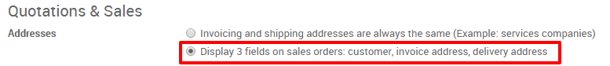
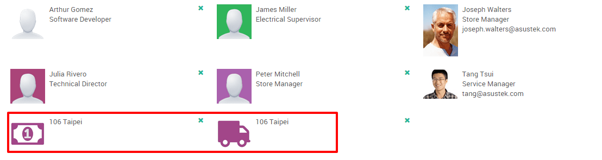

====================================================
How to use different invoice and delivery addresses?
====================================================

Overview
========

It is possible to configure different addresses for delivery and
invoicing. This is very useful, because it could happen that your clients
have multiple locations and that the invoice address differs from the
delivery location.

Configuration
=============

First, go to the Sales application, then click on 
:menuselection:`Configuration --> Settings` and activate the option 
**Enable the multiple address configuration from menu**.

Set the addresses on the contact form
=====================================

Invoice and/or shipping addresses and even other addresses are added on
the contact form. To do so, go to the contact application, select the
customer and in the **Contacts & Addresses** tab click on **Create**

.. image:: media/different_addresses02.png
    :align: center

A new window will open where you can specify the delivery or the invoice
address.

.. image:: media/different_addresses03.png
    :align: center

Once you validated your addresses, it will appear in the **Contacts &
addresses** tab with distinctive logos.

On the quotations and sales orders
==================================

When you create a new quotation, the option to select an invoice address
and a delivery address is now available. Both addresses will
automatically be filled in when selecting the customer.

.. image:: media/different_addresses05.png
    :align: center

.. tip::
    Note that you can also create invoice and delivery addresses on 
    the fly by selecting **Create and edit** in the dropdown menu.

When printing your sales orders, you'll notice the two addresses.

.. image:: media/different_addresses06.png
    :align: center