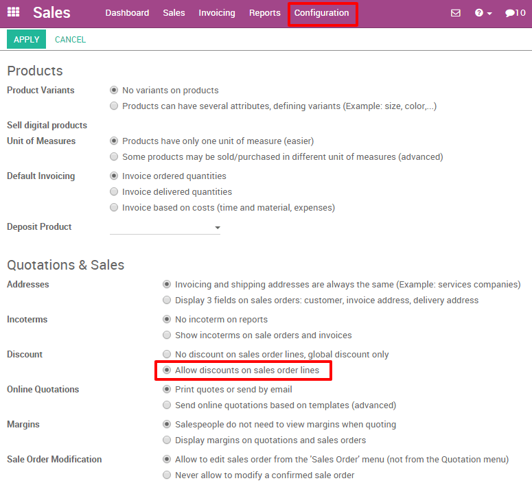
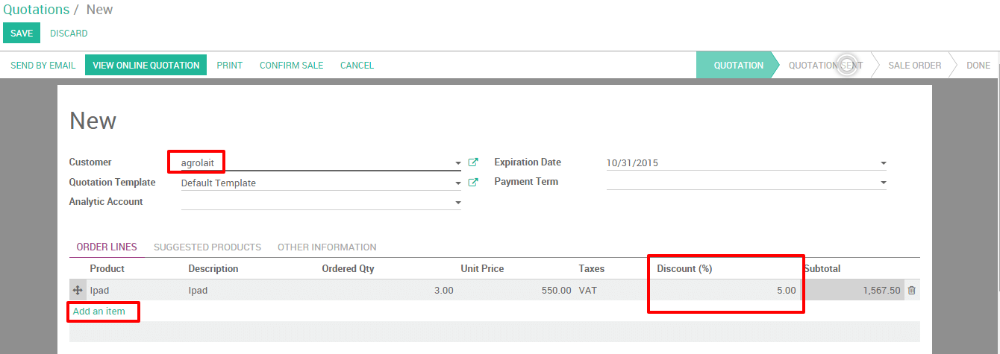
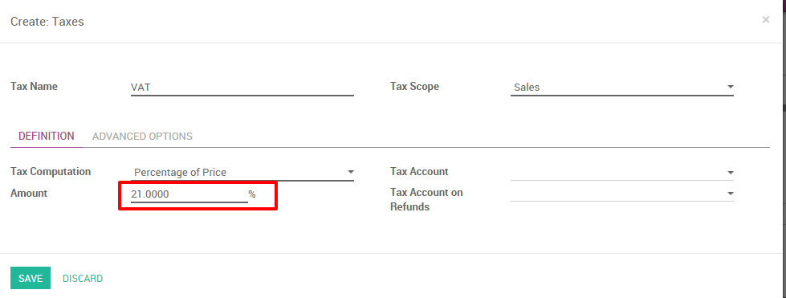
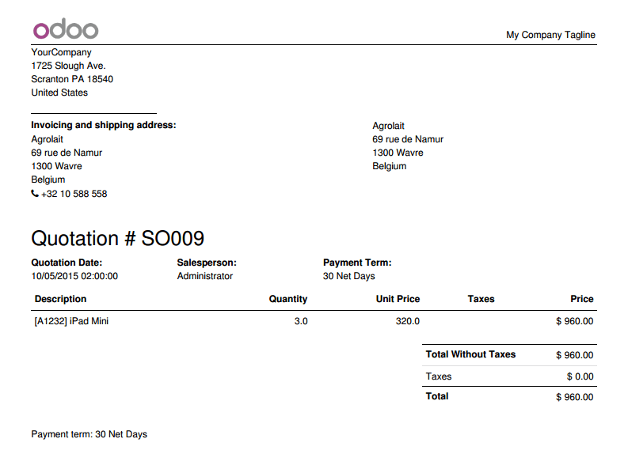
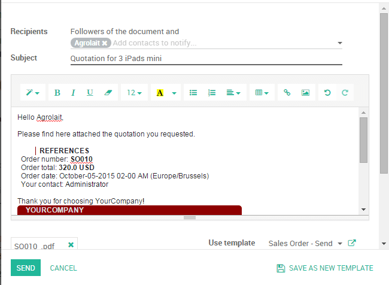

=================================
How to create my first quotation?
=================================

Overview
========

Quotations are documents sent to customers to offer an estimated cost
for a particular set of goods or services. The customer can accept the
quotation, in which case the seller will have to issue a sales order, or
refuse it.

For example, my company sells electronic products and my client
Agrolait showed interest in buying ``3 iPads`` to facilitate their
operations. I would like to send them a quotation for those iPads with
a sales price of ``320 USD`` by iPad with a ``5%`` discount.

This section will show you how to proceed.

Configuration
=============

Install the Sales Management module
-----------------------------------

In order to be able to issue your first quotation, you'll need to
install the **Sales Management** module from the app module in the Odoo
backend.

.. image:: media/first_quote01.png
    :align: center

Allow discounts on sales order line
-----------------------------------

Allowing discounts on quotations is a common sales practice to improve
the chances to convert the prospect into a client.

In our example, we wanted to grant ``Agrolait`` with a ``5%`` discount on the
sale price. To enable the feature, go into the **Sales** application, select
:menuselection:`Configuration --> Settings` and, under **Quotations and Sales**, tick
**Allow discounts on sales order line** (see picture below) and apply your
changes.

Create your quotation
=====================

To create your first quotation, click on :menuselection:`Sales --> Quotations` and
click on **Create**. Then, complete your quotation as follows:

Customer and Products
---------------------

The basic elements to add to any quotation are the customer (the person
you will send your quotation to) and the products you want to sell. From
the quotation view, choose the prospect from the **Customer** drop-down list
and under **Order Lines**, click on **Add an item** and select your product.
Do not forget to manually add the number of items under **Ordered
Quantity** and the discount if applicable.

If you don't have any customer or product recorded on your Odoo
environment yet, you can create them on the fly directly from your
quotations :

-   To add a new customer, click on the **Customer** drop-down menu and click
    on **Create and edit**. In this new window, you will be able to
    record all the customer details, such as the address, website,
    phone number and person of contact.

-   To add a new product, under **Order line**, click on add an item and on
    **Create and Edit** from the drop-down list. You will be able to
    record your product information (product type, cost, sale price,
    invoicing policy, etc.) along with a picture.

Taxes
-----

To parameter taxes, simply go on the taxes section of the product line
and click on **Create and Edit**. Fill in the details (for example if you
are subject to a ``21%`` taxe on your sales, simply fill in the right amount
in percentage) and save.

Terms and conditions
--------------------

You can select the expiration date of your quotation and add your
company's terms and conditions directly in your quotation (see picture
below).

.. image:: media/first_quote05.png
    :align: center

Preview and send quotation
==========================

If you want to see what your quotation looks like before sending it,
click on the **Print** button (upper left corner). It will give you a
printable PDF version with all your quotation details.

.. tip::
    Update your company's details (address, website, logo, etc) appearing 
    on your quotation from the the **Settings** menu on the app switcher, and 
    on click on the link
    :menuselection:`Settings --> General settings --> Configure company data`.

Click on **Send by email** to automatically send an email to your customer
with the quotation as an attachment. You can adjust the email body
before sending it and even save it as a template if you wish to reuse
it.

.. seealso::
    * :doc:`recurring`
    * :doc:`../online/creation`
    * :doc:`optional`
    * :doc:`terms_conditions`