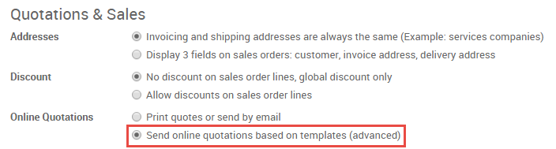
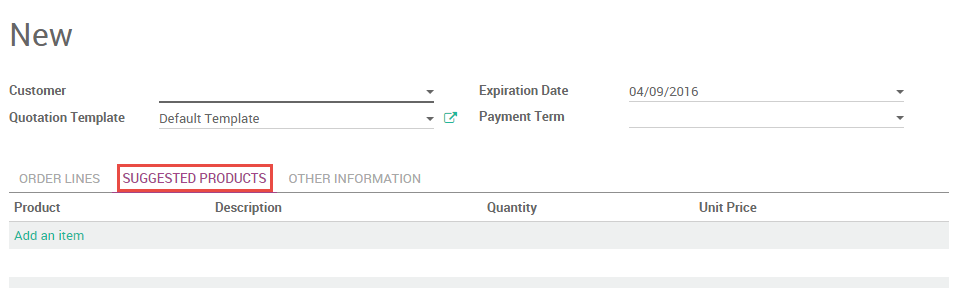
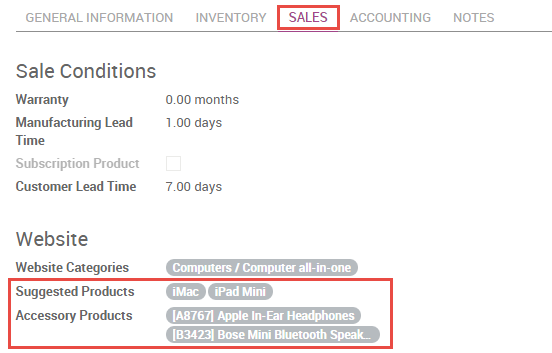

================================================
How to display optional products on a quotation?
================================================

Overview
========

The use of suggested products is a marketing strategy that attempts 
to increase the amount a customer spends once they begin the buying 
process. For instance, a customer purchasing a cell phone could be 
shown accessories like a protective case, a screen cover, and headset. 
In Odoo, a customer can be presented with additional products that are 
relevant to their chosen purchase in one of several locations.

Configuration
=============

Suggested products can be added to quotations directly, or to the ecommerce 
platform via each product form. In order to use suggested products, you will
need to have the **Ecommerce** app installed:

Quotations
----------

To add suggested products to quotations, you must first enable online quotations 
in the Sales app from :menuselection:’Configuration → Settings’. Doing so will 
prompt you to install the Website app if you haven’t already.

You will then be able to add suggested products to your individual quotations and 
quotation templates under the **Suggested Products** tab of a quotation.

Website Sales
-------------

You can add suggested products to a product on its product form, under the Website 
heading in the **Sales** tab. **Suggested products** will appear on the *product* 
page, and **Accessory Products** will appear on the *cart* page prior to checkout.

