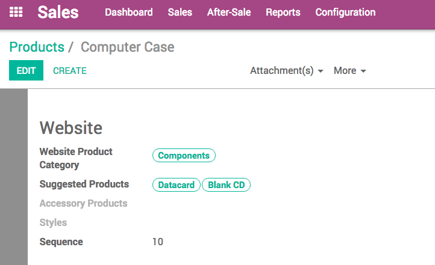
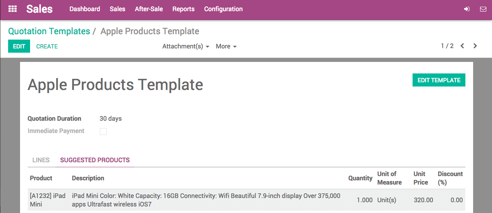
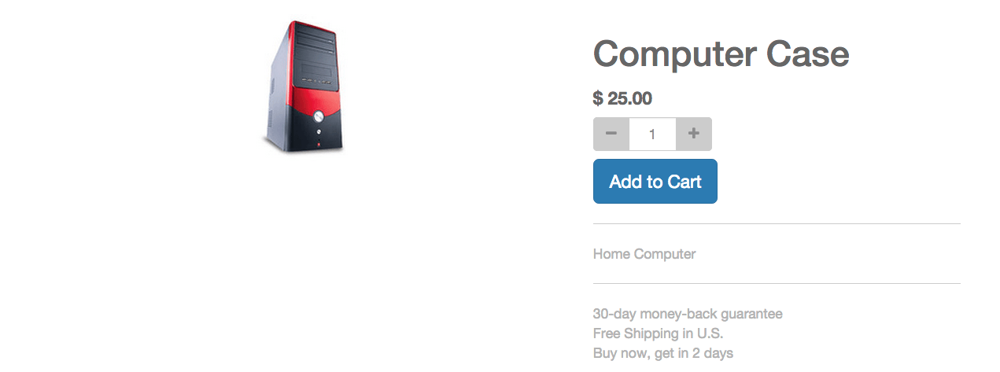
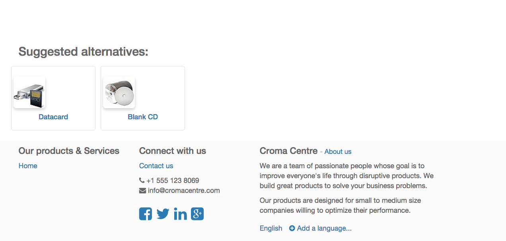
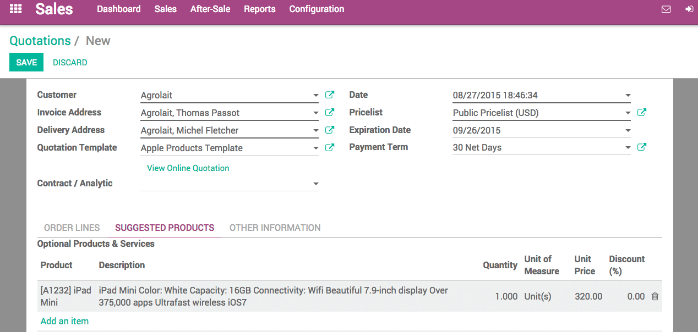

================================================
How to display optional products on a quotation?
================================================

Overview
========

The use of suggested products is a marketing strategy that attempts 
to increase the amount a customer spends once they begin the buying 
process. For instance, a customer purchasing a cell phone could be 
shown accessories like a protective case, a screen cover, and headset. 
In Odoo, a customer can be presented with additional products that are 
relevant to their chosen purchase in one of several locations.

This document covers the configuration and use of suggested products in Odoo.

Configuration
=============

Suggested products can be added to quotations directly, or to the ecommerce 
platform via each product form. In order to use suggested products, you will
need to have the **Ecommerce** applications installed:

Product
-------

On the product form view, under the **Sales** tab, you can set optional products 
on that will be proposed on an order each time that this product is added in the 
cart or on the sale order. On the picture below, we set 2 optional products on a
computer case. 

Quotation template
------------------

We can configure also configure optional products on quotation template like on the 
picture below.

For online quotation design you can follow following topic: :doc:`../online/creation`

Orders with optional product
============================

Online order
------------

Now, if a customer is adding in his cart the Computer Case product on which we set 
2 suggested products, 

on the same page are displayed these 2 products that they can add to their cart too.

The customer can after that complete the sale process from the checkout to the payment. 
For more information on sales you can follow another topic: :doc:`../../overview/process/from_quote_to_so`

Quotation backend
-----------------

We are creating a quotation in the sales application by using a template. The system will 
propose on the sale order form under the **Suggested Products** tab the products that were
defined on the template. 

