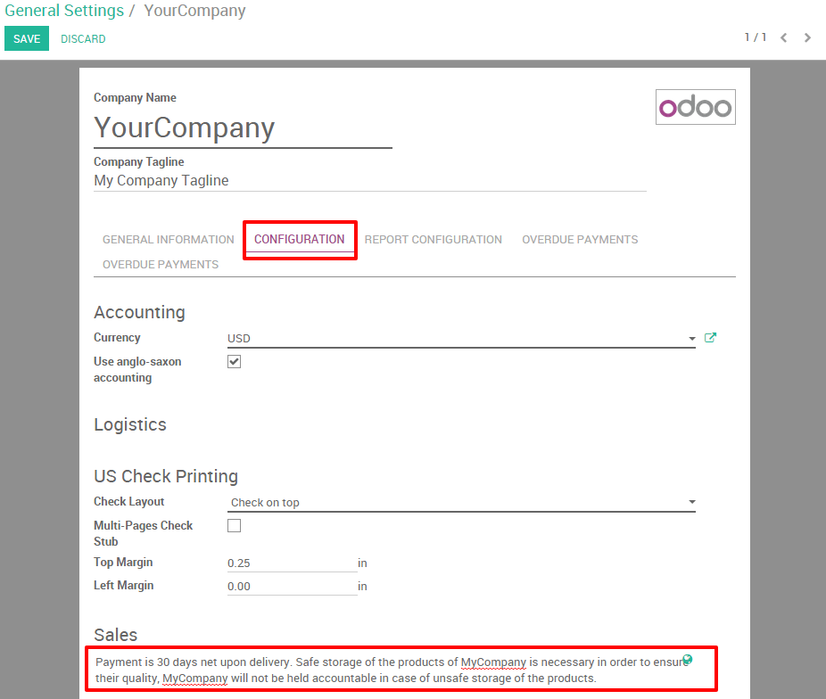
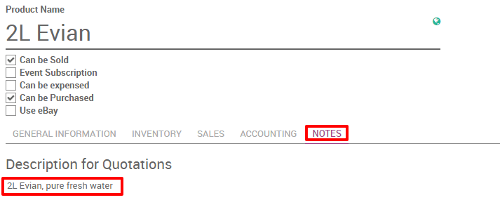
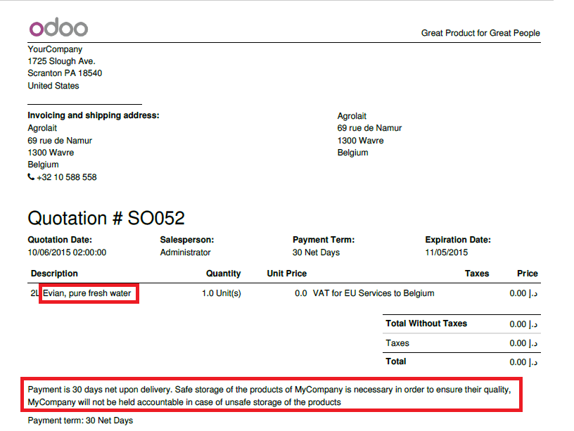

================================================
How to link terms and conditions to a quotation?
================================================

Overview
========

Specifying Terms and conditions is essential to ensure the good
relationships between customer and seller. Every seller has to declare
all the formal information which includes products and company policy so 
customer can read all those terms before committing to anything.

Thanks to Odoo you can easily include your default terms and conditions
on every quotation, sales order and invoice. Moreover you can also
include specific information regarding any products.

Let's take the following example: Your company sells water bottles to
restaurants and you would like to add the following standard terms and
conditions on all your quotations:

-   *Payment is 30 days net upon delivery. Safe storage of the products
    of MyCompany is necessary in order to ensure their quality,
    MyCompany will not be held accountable in case of unsafe storage
    of the products.*

Configuration
=============

No special configuration is needed to be able to add your terms and
conditions. It is however necessary to install the invoice application
to have the possibility of sending out invoices. To do so go into the
app module and install the invoicing application.

.. image:: media/terms_conditions01.png
    :align: center

General terms and conditions
============================

General terms and conditions can be specified in the company data. They
will then automatically appear on every sales document from the
quotation to the invoice.

To specify your Terms and Conditions go into 
:menuselection:`Settings --> General Settings --> Configure your company data`
(see picture below).

.. image:: media/terms_conditions02.png
    :align: center

In this new window you will be able to specify our general terms and
conditions by editing the page and going in the configuration window
(see picture below).

Information on the product
==========================

It is also possible to add specific information regarding a product
on the quotation. To add information regarding the water bottle in your
quotation, go into :menuselection:`Sales --> Sales --> Products`.

Select or create your waterbottle in the products. Click on your product, then click the edit button

If you go into the notes widget you will have the possibility to
specify your description necessary for the quotation (see picture
below).

Quotation and sales terms
=========================

After saving, your terms and conditions appear on your quotation.

