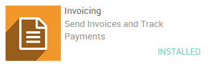
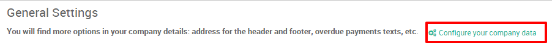

================================================
How to link terms and conditions to a quotation?
================================================

Overview
--------

Specifying Terms and Conditions is essential to ensure a good
relationship between customers and sellers. Every seller has to declare
all the formal information which include products and company policy so
customer can read all those terms before committing to anything.

Thanks to Odoo you can easily include your default terms and conditions
on every quotation, sales order and invoice.

Let's take the following example: Your company sells water bottles to
restaurants and you would like to add the following standard terms and
conditions on all your quotations:

*Safe storage of the products of MyCompany is necessary in order to
ensure their quality, MyCompany will not be held accountable in case of
unsafe storage of the products.*

General terms and conditions
----------------------------

General terms and conditions can be specified in the Sales settings.
They will then automatically appear on every sales document from the
quotation to the invoice.

To specify your Terms and Conditions go into : :menuselection:`Sales --> Configuration --> Settings --> Default Terms and Conditions`.

After saving, your terms and conditions will appear on your new
quotations, sales orders and invoices (in the system but also on your
printed documents).

