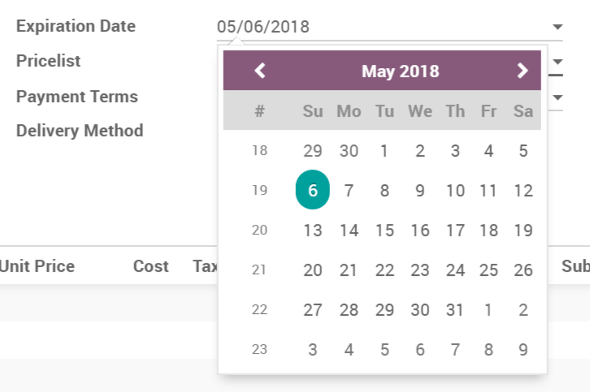
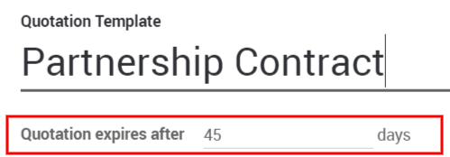
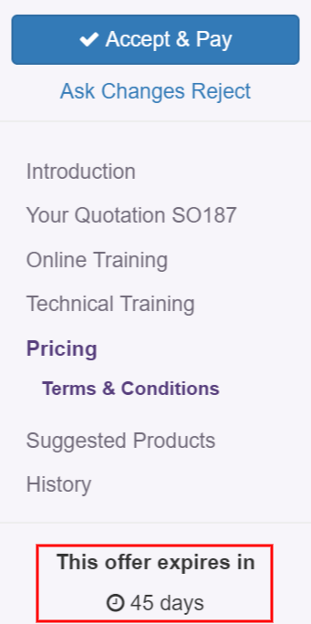

============================================
Stimulate customers with quotations deadline
============================================

As you send quotations, it is important to set a quotation deadline,
both to entice your customer into action with the fear of missing out on
an offer and to protect yourself. You don't want to have to fulfill an
order at a price that is no longer cost effective for you.

Set a deadline
==============

On every quotation or sales order you can add an *Expiration Date*.

Use deadline in templates
=========================

You can also set a default deadline in a *Quotation Template*. Each
time that template is used in a quotation, that deadline is applied. You
can find more info about quotation templates `here 
<https://docs.google.com/document/d/11UaYJ0k67dA2p-ExPAYqZkBNaRcpnItCyIdO6udgyOY/edit>`_.

On your customer side, they will see this:

