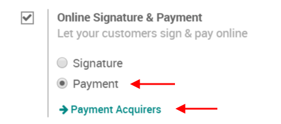
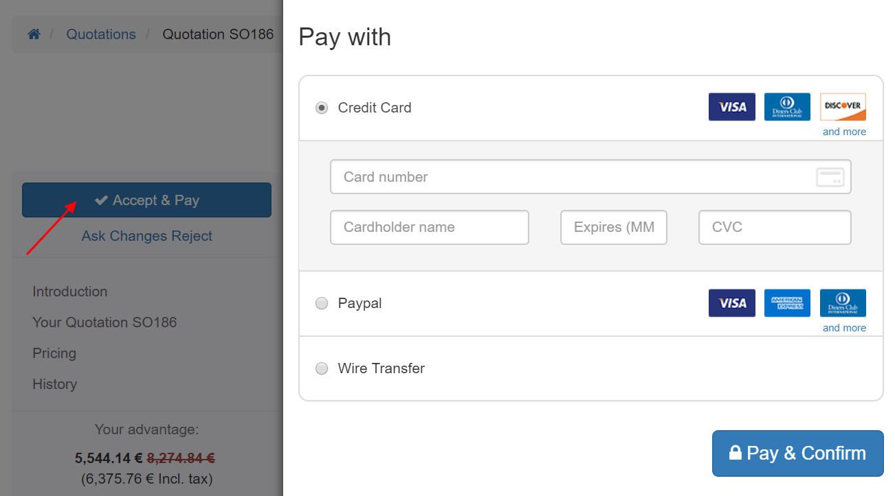

============================
Get paid to confirm an order
=============================

You can use online payments to get orders automatically confirmed.
Saving the time of both your customers and yourself.

Activate online payment
========================

Go to :menuselection:`SALES --> Configuration --> Settings` and activate
the *Online Signature & Payment* feature.

Once in the *Payment Acquirers* menu you can select and configure your
acquirers of choice.

You can find various documentation about how to be paid with payment
acquirers such as `Paypal
<https://www.odoo.com/documentation/user/11.0/ecommerce/shopper\_experience/paypal.html>`_,
`Authorize.Net (pay by credit card)
<https://www.odoo.com/documentation/user/11.0/ecommerce/shopper\_experience/authorize.html>`_, 
and others under the `eCommerce documentation
<*https://www.odoo.com/documentation/user/11.0/ecommerce.html>`_.

.. note::
 If you are using `quotation templates 
 <https://drive.google.com/open?id=11UaYJ0k67dA2p-ExPAYqZkBNaRcpnItCyIdO6udgyOY>`_, 
 you can also pick a default setting for each template.

Register a payment
===================

From the quotation email you sent, your customer will be able to pay
online.

