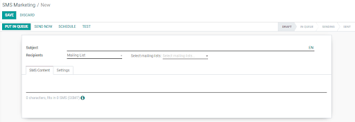

===============================================
Build, send and get reports from a SMS mailing
===============================================

Why to use SMS?
Using SMS Marketing as part of my communication strategies can empower me to expand my markets, considering that in some countries emails are not very used or used at all. It also helps to boost my conversion rate, as this strategy has a high open-rate percentage among people who use smartphones - people usually don’t keep unread SMSs!

With Odoo’s SMS Marketing app you can plan, organize, schedule and keep track of your mailings with its easy to use interface.

Install the app
==================================
Go to *Apps*, search for *SMS Marketing* and click on *Install*.

Build an SMS mailing
==================================
Go to *SMS Marketing > Create*.

First, I’ll be able to specify a *subject* name that will help me to remember what the mailing is about.
Under *recipients*, I’ll choose to whom I’d like the SMS to be sent. If I choose *Contact*, all my Odoo contacts (vendor, customers, etc.) will receive my SMS.
From there, I can refine my recipient list with the *add filter* option. In the example below, I choose to send it to my contacts living in Belgium.

The *Mailing list* option, on the other hand, allows me to choose mailing lists I’ve created with specific contacts or people who have subscribed to my Newsletters, or both! I’m allowed to select more than one *Mailing list*.

Under the *SMS Content* tab, links can be included and Odoo will automatically generate *link trackers*. Thank to those, I’ll be able to get data about those links.

On *Settings* I have the option *include opt-out link* available. If activated, the contact will be able to unsubscribe from the mailing list he’s not interested in anymore.

.. tip:: in the *Link Tracker* menu under *Configuration*, I can see the history of my sent links, access them and look at statistics.

.. note:: Double-check that you have the phone number of your contacts saved!

Sending my mailing
==================================

Once I have my mailing created, I must choose when I would like it to be delivered:

- *Put in queue*: the mailing will be triggered with the next automatic run.
   Interesting option if I don’t mind when the triggering will happen.
- *Send now*: sends the message immediately.
   Advised to use this option if there are not that many recipients.
- *Schedule*: allows me to choose a day and time.
   Best option for mailings that I would like to send during a specific event, to promote an offer while it is active or to simply plan my content strategy in advance.
- *Test*: allows me to send an SMS to one or multiple numbers for test purposes.
   Check, for example, if the link provided lands on the right page while making sure they are responsive. If sending it to multiple numbers, I must remember to use a comma between them.

Visualize reports
==================================
On the *Reporting* menu, with just a few clicks, I am capable of applying filters, measures and adopt different layouts to do an analysis of the performance of my SMS mailings.

.. tip:: I can also check the price to send an SMS on your country when clicking on the *information* icon when creating a new SMS.
