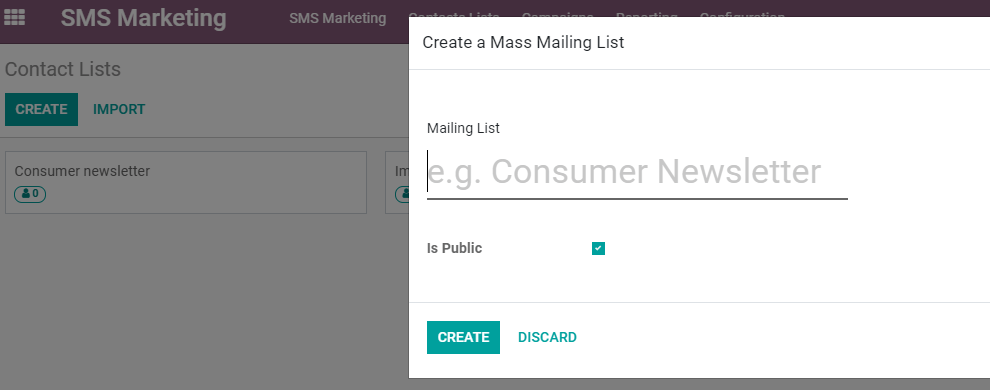
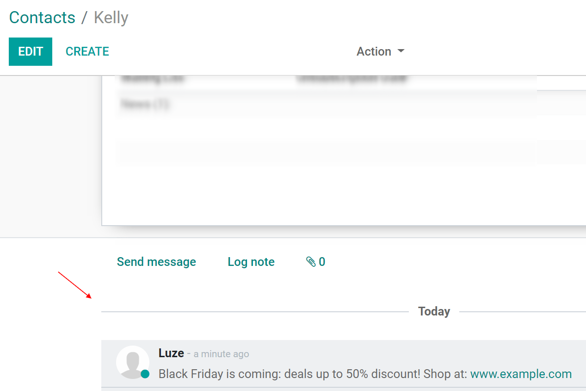
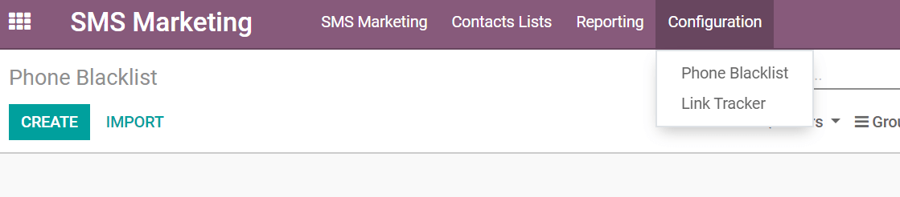

==================================
Contact lists and Blacklist
==================================

Contact lists
==================================
Creating my own list of contacts, or importing it, is useful when I want to create specific groups of people, such as the subscribers of my newsletter. It is also the best way to get started if I am coming from another system and already have built an audience. It makes the SMS distribution a lot easier.

Go to *Contacts lists > Contacts lists > Create*.
I’ll choose a name for my *Mailing list*, and activate the option *Public* if I would like to make the mailing list accessible to my recipients in the unsubscription page to allow them to update their subscription preferences.

Once inside the list, I can again *Create* or *Import* contacts for that specific list.

History with the Log Notes
-----------------------------
A record of the mailings sent is kept in the chatter of the recipient (whether it is a contact or an opportunity, for example).

This is important as I and my team can easily keep track and see a history of interactions with my contacts or prospects, granting me the ability to better understand them.
Example: my sales representative can easily find out which SMS mailing promotions a customer has received or not.

Blacklist
==================================
If I’m coming from another software and have a list of clients who have already asked to be blacklisted from my news, I can import those entries in my database.
For that, I’ll go to *Configuration > Phone Blacklist > Import*.

