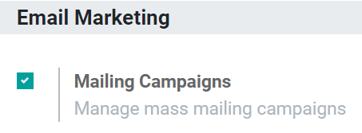
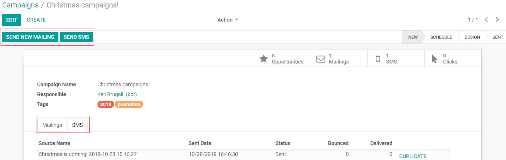
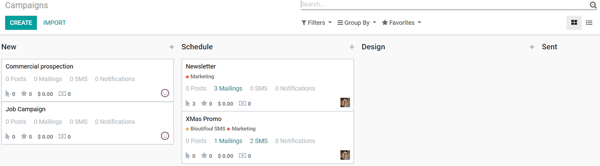
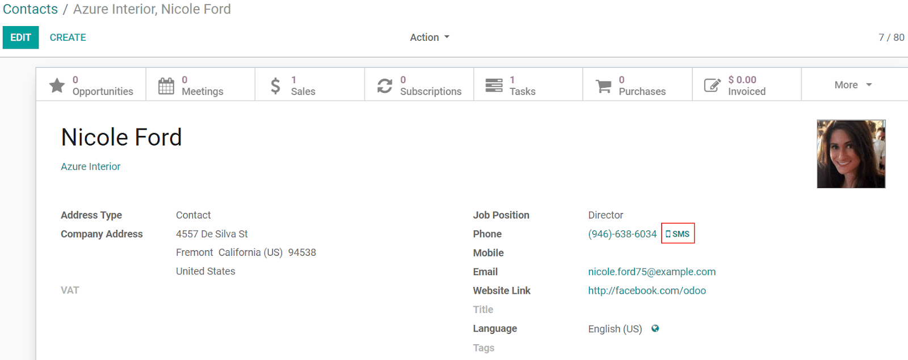
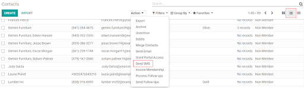
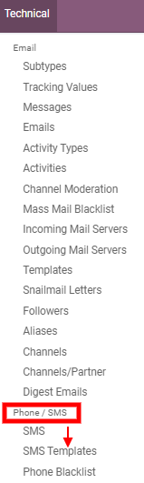
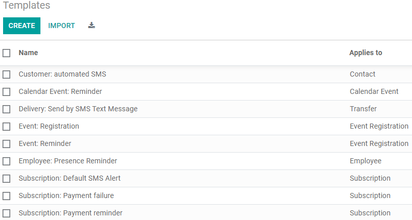

==================================
Integrations and Templates
==================================
Using SMS to reach people can be a strategy not just used for advertisement purposes but also as a reminder of events or issued invoices to your costumers, for example.
As you know, one of the biggest benefits of using Odoo is the capability of the apps to be integrated. 
With the SMS Marketing app isn’t different!

Organize Email Marketing and SMS campaigns
===========================================
First, make sure to have the necessary feature activated. Go to the :menuselection:`Email Marketing
app --> Configuration --> Settings --> activate the option Mailing Campaigns`.

Now, I’ll also have the menu *Campaigns* included in my *SMS Marketing* page, allowing me to have an overview of my SMS mailings and my email marketing ones.

This feature is especially useful if I have aggregated campaigns, as I have a global reporting view. In addition to that, I can create stages in my kanban view to better organize the work being done.

Sending SMSs through the Contacts app
======================================
Sending SMSs through the contact’s form is available by default in Odoo. It makes my work easier if I need to send an SMS to a specific contact, for example.
For that, I’ll go to the *Contacts* app, select the contact and click on the *SMS* icon next to the phone number.

If I’d like to send a message in a batch here, I could go to :menuselection:`List View --> select
all the contacts --> Action --> Send SMS`.

   
Set up SMS Templates
==================================
To set up *SMS Templates*, I’ll go to the *Settings* app and activate the *developer mode*. Now,
back to *Settings* app, I’ll go to :menuselection:`Technical --> Phone/SMS section -->
SMS Templates` and create the content I need.

.. tip:: Use *Dynamic Placeholders* to adapt automatically the content of the SMS to the context.

.. note:: 

   SMS Text Messaging is available throughout Odoo! Here are some of our extra notable integrations: 
   
   - *CRM*: send SMSs to your leads and opportunities.
   - *Subscription*: alert customers about their subscription.
   - *Accounting*: send payment reminders.
   - *Marketing Automation*: automate your SMS marketing campaigns.
   - *Inventory*: send an automatic confirmation when a delivery order is done.
   - *Sign*: receive a validation code to verify your identity before signing a document online.
   - *SEPA debit payment provider*: send a verification code to your customers.
   - *Studio*: send an SMS according to your needs by using automated actions.

For more information about SMS integrations in Odoo and a list of frequently asked questions, go to `Pricing and FQA <fqapricing.html>`__.

