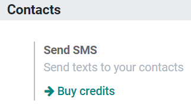

======================
SMS Pricing and FAQ
======================

Pricing
==================================
SMS Text Messaging is an In-App Purchase (IAP) service which requires prepaid credits to work. The price of an SMS depends on the destination and the length of the message. With 1 credit, I can send up to 92 SMSs.

**For more information, please consult our FAQ page**: `Odoo SMS - FAQ <https://iap-services.odoo.com/iap/sms/pricing#sms_faq_01>`_

To buy credits I will go to *Settings >  Buy Credits* (under *Send SMS*); or go to *Settings > View my Services* (under *Odoo IAP*).

.. image:: media/fqa2.png
    :align: center
	
.. tip:: If you are on Odoo Online (SAAS) and have the Enterprise version, you benefit from free trial credits to test the feature.

FAQ
==================================
**Is there an expiration time for my credits?**

No, your credits won’t expire.

**Can I send an SMS to a phone number (which is not a mobile phone) because I see the icon in front of the field “phone”?**

Only if that phone number supports SMS (e.g. SIP phones).

**Do I receive an invoice to buy my credits?**

Yes.

**Can the recipient answer to me?**

No, it is not possible to reply to the SMS.

**What happens if I send multiple SMS but I do not have enough credits to send them all?**

The whole transaction is counted as a single one, so no SMS will be sent until you have enough credits to send them all.

**Do I have a history of the sent SMSs?**

Yes, the SMS is logged as a note under the chatter of the corresponding record, and a complete history of SMS sent is available under Settings> Activate the developer mode > Technical > SMS.

**Can I send as many SMSs I want at once?**

Yes, if you have enough credits.

**If I have a number that does not exist in the list of recipients, will I lose credits?**

Not if the phone number is in the wrong format (e.g. too many digits). Otherwise, if the SMS is sent to the wrong person or to a fake number, the credit will be lost.

**What happens if I send my SMS to a paying number (e.g.: a contest to win a ticket for a festival)?**

The SMS will not be delivered to that kind of number, so you won’t be charged.

**Can I identify the numbers that do not exist when I send several SMSs?**

Only the ones that have an invalid format.

**How does the GDPR regulation affect this service?**

Please find our Privacy Policy here: `Odoo IPA Purchase Privacy Policy <https://iap.odoo.com/privacy#sms>`__  

**How many types of SMS exist and how many characters make 1 SMS?**

There are 2 types of SMS message:

*Standard* (GSM-7): contains only characters from the GSM-7 set, which can be seen in the following picture.

.. image:: media/fqa3.png
    :align: center

*Unicode*: contains at least one character that is not in the previous table.
For Standard SMS the size limit is 160 characters, and for Unicode is 70. Above these limits, the content is divided into a multi-part message. The system will inform you in real-time about the number of SMS your message represents.
