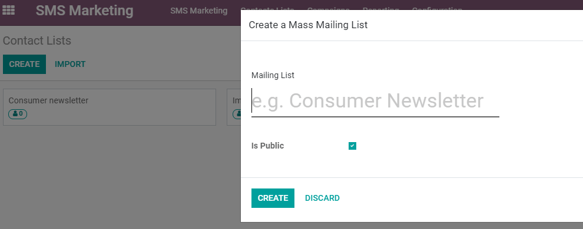
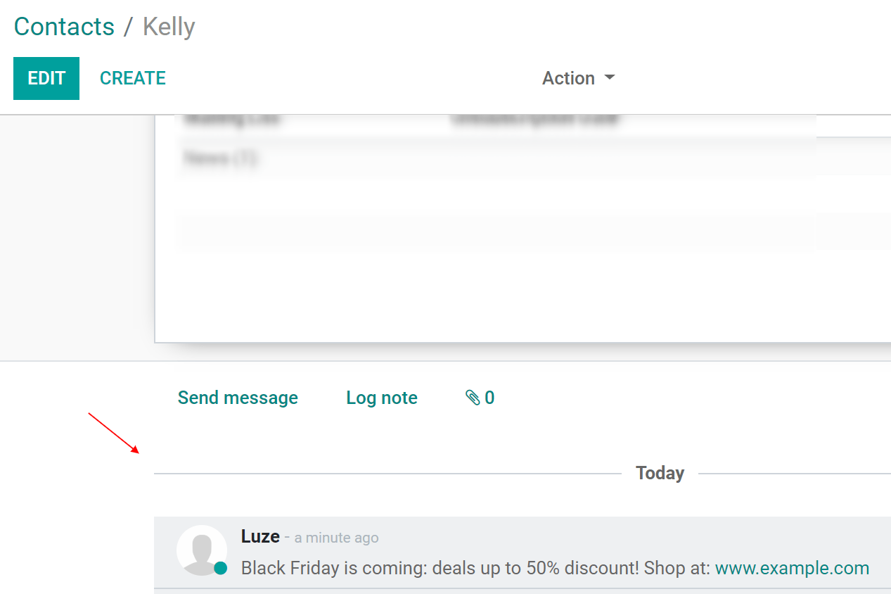

===========================
Contact Lists and Blacklist
===========================

Creating your own list of contacts, or importing it, is useful when you want to create specific
groups of people, such as the subscribers of your newsletter. It is also the best way to get started
if you are coming from another system and already have built an audience. It makes the SMS
distribution easier.

Contact lists
=============

| Go to :menuselection:`Contacts lists --> Contacts lists --> Create`.
| Choose a name for your *Mailing list*, and activate the option *Is Public* if you would like to
  make the mailing list accessible to your recipients in the unsubscription page (allowing users to
  update their subscription preferences).

History with the Log Notes
--------------------------

| A record of the mailings sent is kept on the recipient's chatter (whether it is a contact or
  an opportunity, for example).
| This is important as you and team members can easily keep track and see a history of the
  interactions with your contacts or prospects. Example: your sales representative can easily find
  out which SMS mailing promotions a customer has received or not.

Blacklist
=========

| If you are coming from another software and have a list of clients who have already asked to be
  blacklisted, you can import those entries to your database.
| For that, go to :menuselection:`Configuration --> Phone Blacklist --> Import`.

.. image:: ./media/sms_marketing11.png
   :align: center