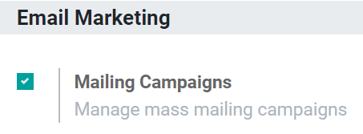
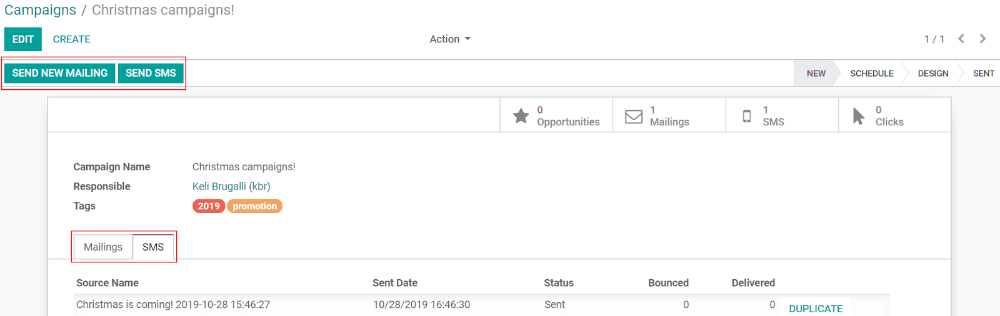
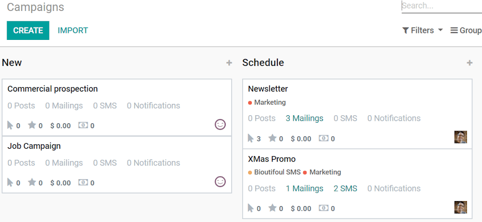
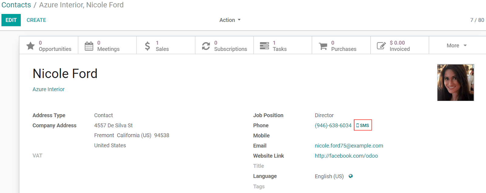
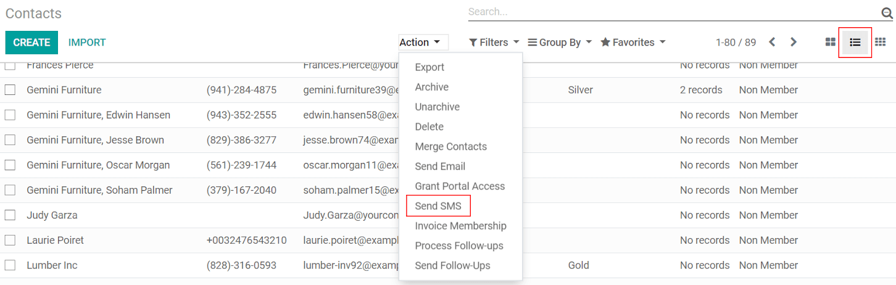

==========================
Integrations and Templates
==========================

Using SMS to reach people can be a strategy not just used for advertisement purposes, but also as a
reminder of events or issued invoices to your costumers, for example.

Campaigns
=========

First, make sure to have the necessary feature activated. Go to the :menuselection:`Email Marketing
app --> Configuration --> Settings` and enable *Mailing Campaigns*.

Now, the menu *Campaigns* is also available on the *SMS Marketing* app, allowing you to manage and
have an overview of your SMS mailings under campaigns.

This feature is especially useful if you have aggregated campaigns, as you have a global reporting
view. In addition to that, you can create stages in your Kanban view to better organize the work
being done.

Sending SMSs through the Contacts app
=====================================

| Sending SMSs through the contact’s form is available by default in Odoo. It makes your work easier
  if you need to send an SMS to a specific contact, for example.
| For that, go to the *Contacts* app, select the contact and click on the *SMS* icon next to the
  phone number.

If you would like to send a message to multiple contacts at once, choose the *List View*, select
all the contacts needed, and under *Action* select *Send SMS*.

Set up SMS templates
====================

To set up *SMS Templates*, activate the :doc:`Developer mode <../../general/developer_mode/activate>`,
then go to :menuselection:`Technical --> SMS Templates`.

.. image:: ./media/sms_marketing17.png
   :align: center

.. image:: ./media/sms_marketing18.png
   :align: center

.. tip::
   Use *Dynamic Placeholders* to adapt automatically the content of the SMS to the context.

.. note::
   SMS Text Messaging is available throughout Odoo:
   
   - *CRM*: send SMSs to your leads and opportunities.
   - *Subscription*: alert customers about their subscription.
   - *Accounting*: send payment reminders.
   - *Marketing Automation*: automate your SMS marketing campaigns.
   - *Inventory*: send an automatic confirmation when a delivery order is done.
   - *Sign*: receive a validation code to verify your identity before signing a document online.
   - *SEPA debit payment provider*: send a verification code to your customers.
   - *Studio*: send an SMS according to your needs by using automated actions.

.. important::
   For more information about SMS integrations in Odoo and a list of frequently asked questions,
   go to :doc:`../pricing/pricing_and_faq`.

.. seealso::
   - :doc:`../../social_marketing/overview/campaigns`
   - :doc:`../../email_communication/advanced/email_template`