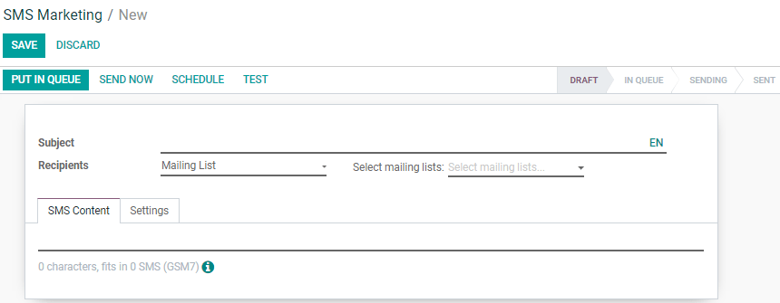
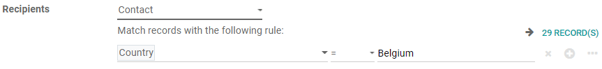
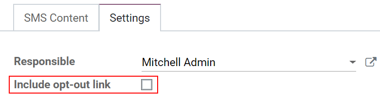
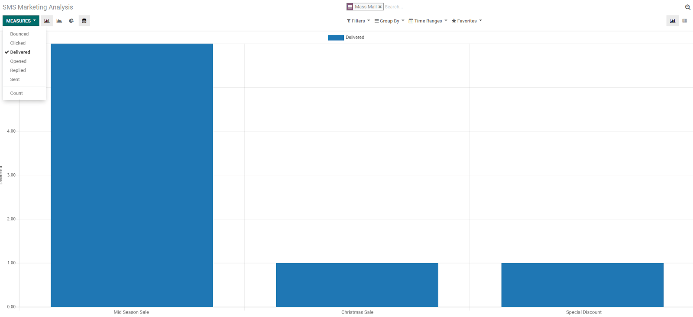

===============================================
Build, Send and Get Reports from a SMS Mailing
===============================================
Using SMS Marketing as part of your communication strategies can empower you to expand your markets,
considering that in some countries emails are not very used or used at all. It also helps to boost
conversion rates, as this strategy has a high open-rate percentage among people who use
smartphones - people usually don’t keep unread SMSs!

Install the app
===============

Go to *Apps*, search for *SMS Marketing* and click on *Install*.

Build an SMS mailing
====================

Go to :menuselection:`SMS Marketing --> Create`.

| First, you will be able to specify a *subject* name that will help you to remember what the
  mailing is about.
| Under *recipients*, choose to whom you would like the SMS to be sent. If you choose *Contact*,
  all your Odoo contacts (vendor, customers, etc.) will receive your SMS.
| From there, you can refine your recipient list with the *add filter* option. In the example below,
  the message will be sent to contacts living in Belgium.

The *Mailing list* option, on the other hand, allows you to choose mailing lists you ve created with
specific contacts or people who have subscribed to your Newsletters, or both!
Note that you are allowed to select more than one *Mailing list*.

.. image:: ./media/sms_marketing3.png
   :align: center

| Under the *SMS Content* tab, links can be included and Odoo will automatically generate
  *link trackers*. Thank to those, you will be able to get data about those links.

| On *Settings* you have the option *include opt-out link* available. If activated, the contact
  will be able to unsubscribe from the mailing list he is not interested in anymore.

.. tip::
   In the *Link Tracker* menu under *Configuration*, you can see the history of your sent links,
   access them and look at statistics.

   .. image:: ./media/sms_marketing5.png
      :align: center

.. note::
   Double-check that you have the phone number of your contacts saved.

Sending my mailing
==================

.. image:: ./media/sms_marketing6.png

Once you have your mailing created, you must choose when you would like it to be delivered:

- Put in queue: the mailing will be triggered with the next automatic run. Interesting option
  if you do not mind when the triggering will happen.
- Send now: sends the message immediately. Advised to use this option if there are not that
  many recipients.
- Schedule: allows you to choose a day and time. Best option for mailings that you would like to
  send during a specific event, to promote an offer while it is active or to simply plan your
  content strategy in advance.
- Test: allows you to send an SMS to one or multiple numbers for test purposes. Check, for
  example, if the link provided lands on the right page while making sure they are responsive. If
  sending it to multiple numbers, you must remember to use a comma between them.

Visualize reports
=================
On the *Reporting* menu, with just a few clicks, you are capable of applying filters, measures and
adopt different layouts to do an analysis of the performance of your SMS mailings.

.. tip::
   You can also check the price to send an SMS on your country when clicking on the
   *information* icon when creating a new SMS.

   .. image:: ./media/sms_marketing8.png
      :align: center

.. note::
   **Buy Credits!**
   In order to take advantage of the app and its features, make sure you have purchased credits.
   For more information on that access: :doc:`../pricing/pricing_and_faq`
