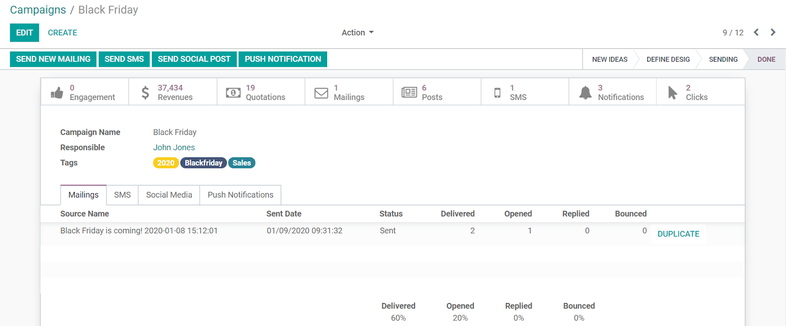

===========================================
Connecting to my Marketplace with Campaigns
===========================================

Whether your goal is to sell a new product, explain the value of your services or advertise your
event, a campaign helps you to connect with your marketplace. They normally involve multiple
channels, so it is fundamental to have a solution with which you can plan, execute, track, and
analyze your content.

Go to :menuselection:`Social Marketing --> Campaigns --> Create`.

As you create content, tabs for that specific channel will be shown. The overview of the campaign
shows you global metric such as:

- *Revenue*: number of users who, from a link in your content, finished a transaction (paid).
- *Quotations*: number of users who, from a link in your content, have started but not finished a
  transaction (did not pay).
- *Leads*: users who have filled out your contact form, from a link in your content.

.. important::
   To be able to *Send New Mailing*, make sure the feature is enabled in the *Email Marketing*
   application, under :menuselection:`Email Marketing --> Configuration --> Settings`.
   To be able to *Send SMS*, the *SMS Marketing* application must be installed on your database.

.. note::
   *Social Marketing* works integrated with other applications such as *Sales*,
   *Invoicing*, *CRM* and *Website*.

.. seealso::
   - :doc:`./push_notifications`
   - :doc:`./manage_social`

