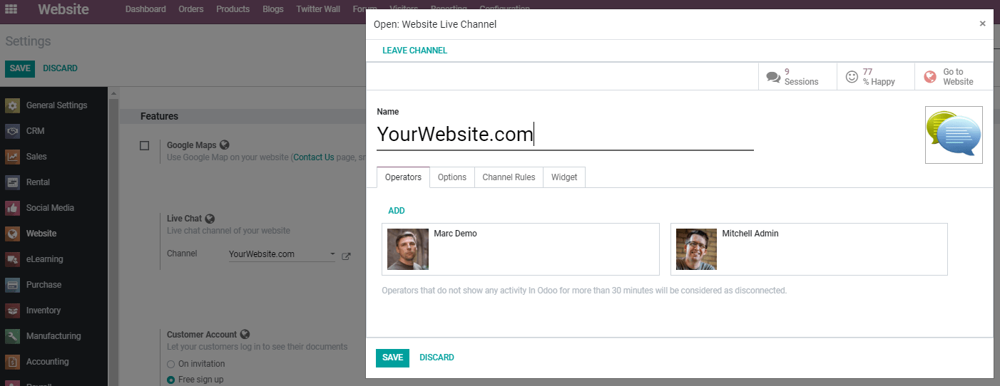
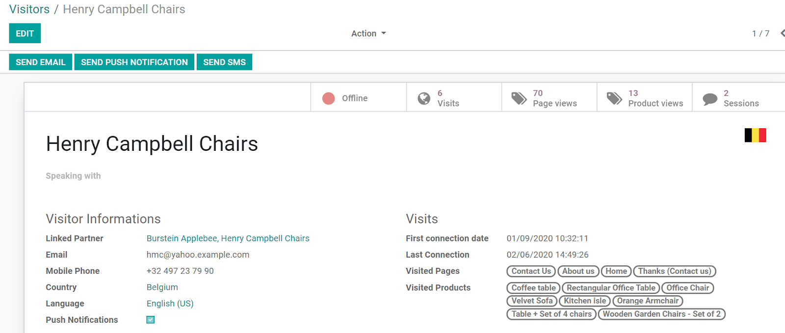
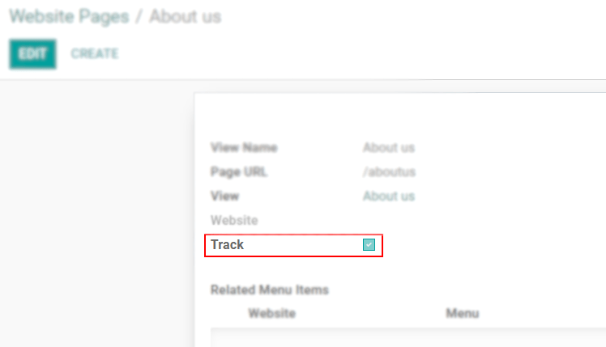

===================================================
Interact with Customers and Visitors with Live Chat
===================================================

One of the ways you can build stronger relationships with your customers is by making yourself
available through live chat. Live chats can have a big impact not just on your customer service,
but also on sales performance, as it gives users a chance of having real-time, fast, and effective
interaction.

Configuration
=============

Go to :menuselection:`Website --> Configuration --> Settings --> Live Chat` select the appropriate
channel, and set it up.

Under *Channel Rules*, choose when the chat pop-up appears, and an action for a given URL and/or
country. Note that to take the country into account, GeoIP must be installed on your server.

.. important::
   The *Live Chat* application must be installed on your database.

Monitor your visitors
=====================

Under the  *Visitors* menu,  see the visitors that landed on one of your
:ref:`social_marketing/website_tracked_pages` online or offline.

| You can send emails (if an email address has been saved), send SMSs (if a phone number has been
  saved), send a push notification (if the user has subscribed to it), and even send a live chat
  request that will be received by the user once they move to a tracked page.
| Open a record to see details including the visited pages, and the first and last date and time
  the user was connected.

.. tip::
   #. Your online visitors will be authenticated if they are linked to a lead or an existing partner.
   #. If you do not use the *Website* app, you can add a live chat widget to your own website.

.. _social_marketing/website_tracked_pages:

Website’s tracked pages
-----------------------

To define which pages are tracked, on the *Website* application, go to
:menuselection:`Website --> Configuration --> Pages` and enable the option *Track*,
on the respective pages.

.. seealso::
   - :doc:`../../livechat/overview/get_started`
