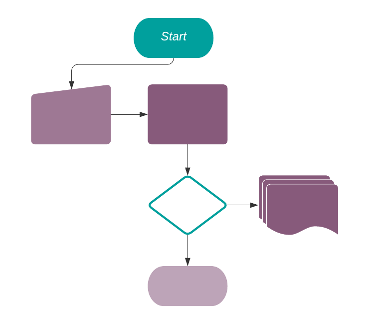

===============================
Understanding Automated Actions
===============================

| Automated actions are used to trigger actions. They are based on conditions and happen on top of
  Odoo’s default business logic.
| Examples of automated actions include: creating a next activity upon a quote's confirmation;
  adding a user as a follower of a confirmed invoice if its total is higher than a
  certain amount; or preventing a lead from changing stage if a field is not filled in.

| Let's understand how to properly define *when* an automated action runs and *how* to create one:
| The first step is to choose the :doc:`Model <understanding_general>` on which the action is
  applied.
| The **Trigger** field defines the event that causes the automated action to happen:

- *On Creation*: when a new record is created. Note that the record is created once saved for the
  first time.
- *On Update*: when the record is updated. Note that the update happens once the record is saved.
- *On Creation & Update*: on the creation and/or on the update of a record once the form is saved.
- *On Deletion*: on the removal of a record under the condition set.
- *Based on Form Modification*: when the value of the specified *Trigger* field is changed in the
  interface (user sees the changes before saving the record). Note that this action can only be used
  with the *Execute Python Code* action type.
- *Based on Timed Condition*: a delay happens after a specific date/time. Set a *Delay after trigger
  date* if you need a delay to happen before the *Trigger Date*. Example: to send a reminder 15min
  before a meeting. If the date/time is not set on the form of the model chosen, the date/time
  considered is the one of the creation/update of the record.

For every Trigger option, **conditions** can be applied, such as:

- *Before Update Domain*: if designated, this condition must be satisfied before the record is
  updated.
- *Apply on*: if designated, this condition must be satisfied before executing the action rule
  (*Action To Do*), and after the update.

| The **Active** option is to be turned off when the rule should be hidden and not executed.
| Under **Action To Do** choose the type of server action that must be executed once records meet
  the *Trigger* conditions:

- *Execute Python Code*: a block of code is executed. A *Help* tab with the variables that can be
  used is available.
- *Create New Record*: a new record with new values is created.
- *Update a Record*: updates the record that triggered the action.
- *Execute several actions*: defines an action that triggers other server actions.
- *Send Email*: an automatic :doc:`email <../../email_communication/advanced/email_template>` is sent.
- *Add Followers*: :doc:`followers <../../project/tasks/collaborate>` are notified of changes in
  the task.
- *Create Next Activity*: creates an activity such as: *Call*, *Email*, *Reminder*.
- *Send SMS Text Message*: sends an :doc:`SMS <../../sms_marketing/pricing/pricing_and_faq>`.

Example
~~~~~~~

This is the process of which the update of the *Email* field on the Lead/Opportunity *Model*, with a
*Trigger Condition* set to *On Update*, goes through:

.. image:: media/action_update_lead_example.png
   :align: center
   :alt: View of an automated action being created in Odoo Studio

#. The user creates the record without an email address set.
#. The user updates the record defining an email address.
#. Once the change is saved, the automation checks if any of the *Watched Fields* are being updated
   (for the example: field name *email_from* (Email).
#. If true, it checks if the record matches the *Before Update Domain* (for the example: *email
   is not set*).
#. If true, it checks (*after the update*) whether the record matches the *Apply on* domain (for the
   example: *email is set*).
#. If true, the chosen *Action To Do* is performed on the record.

.. seealso::
   - :doc:`understanding_general`
   - :doc:`../use_cases/automated_actions`

