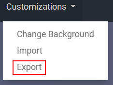
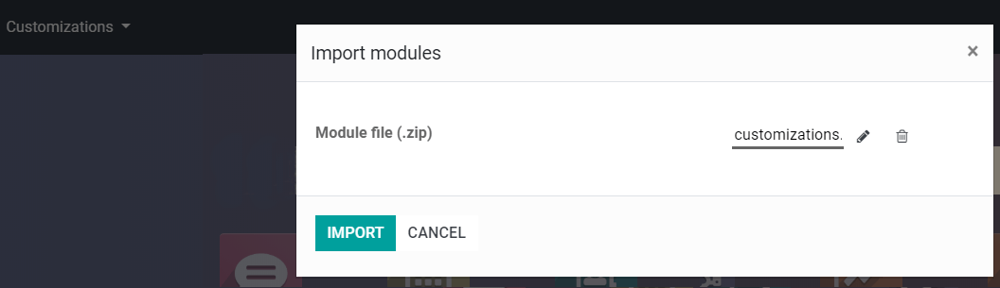

=========================
Export and Import Modules
=========================

When you do customizations in Odoo Studio, a new module is created in your database, making it easy
to use Studio for prototyping.

To export these customizations, activate Studio on the main dashboard and, under the menu
*Customizations*, click on *Export*. The default filename is *customizations.zip*.

| The module created contains the definition of custom models and fields, as well as the UI elements
  of any customization in an XML format.
| To import and install the customizations in another instance, connect to the destination database,
  activate Studio and, under *Customizations*, click on *Import*.

.. warning::
   Studio does not know which apps are customized (because the same view can be modified on
   different apps), therefore, it *does not* add the underlying modules as dependencies of the
   exported module. In other words, the applications installed on the source database should be
   installed on the destination database.