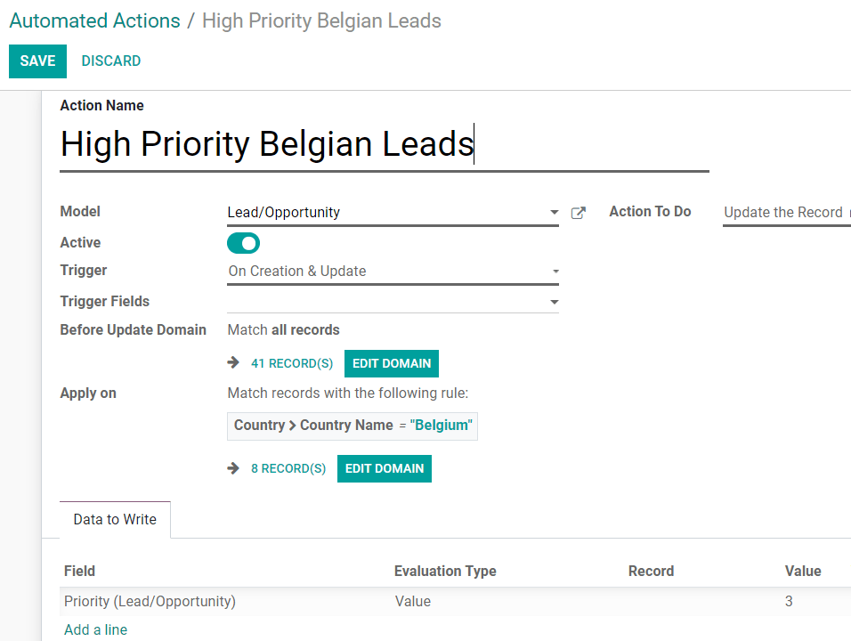

=====================================
Advanced Use Cases: Automated Actions
=====================================

- **Case scenario 1: when a Belgian lead is created, a 3-stars priority should be automatically
  applied.**

Under *Automations*,  click on *Create* and set the following rules:

- *Model*: Lead/Opportunity
- *Active*: On
- *Trigger*: On Creation & Update
- *Apply on*: Country > Country Name = Belgium
- *Action To Do*: Update the Record
- *Data to Write*: Lead/Opportunity > Value > 3

.. tip::
   Check :doc:`this doc <filters_status_bar>` in order to have another automated action example.

.. seealso::
   - :doc:`../concepts/understanding_automated_actions`
   - :doc:`../concepts/understanding_general`