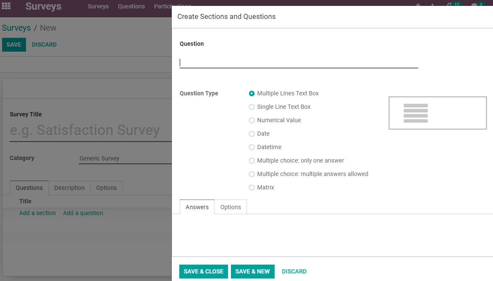

================
Create a  Survey
================

Surveys can be used for a range of purposes that can go from collecting customer feedback, evaluate
the success of an event, measure how pleased customers are with your products/services, gauge
whether employees are happy and satisfied with their work environment, and even to find out what
your market is thinking.

Get started
===========

Choose the type of answer you would like your question to have, and under *Options* find the
feature *Mandatory Answer*.

| Write a *Description* to be displayed on the homepage of the survey, and under *Options*, find
  features such as *Time Limit* and *Scoring*.
| *Test* to go through the survey before sharing it, avoiding errors.
| Once done, click on *Start Survey* to be able to *Share* it with your recipients (respondents).

Getting responses and analysing results
=======================================

| As your recipients respond to it, the answers can be seen under the status button *Answers*, or
  under :menuselection:`Survey --> Participations --> Participations`.
| If checking the answers under *Participations*, more details such as the number of attempts and
  skipped answers a respondent took are shown.

Click on *See results* to see an analysis of the responses, and if you chose to have a scoring
system and certificate available, a *Certified* status menu becomes available.

