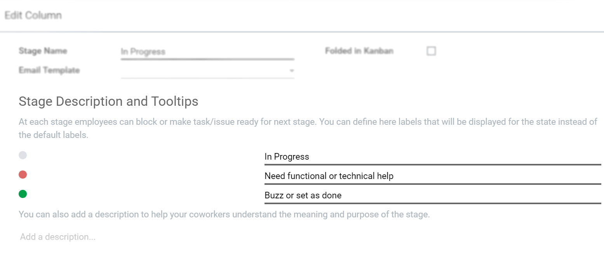

========================
Get Started with Project
========================

Managing projects means managing people, tasks, due dates, budgets and predicted return on
investments. For all of it, you need a solution that allows you to reduce risks, get information at
a glance, have an overview of your progress and stay organized. And, from start to finish, to be
able to run multiple projects in parallel easily. Odoo Project application is the solution you need.

Creating a new project
======================

Click on *Create*. Specify the name of the project and choose which features you would like to
integrate. Note that they can be enabled afterward through *Settings*.

.. image:: media/create_new.png
   :align: center
   :alt: Click on create to start a new project in Odoo Project

Manage your project’s stages
============================

| Open your project and add as many columns as there are stages in your project.
| Each project stage can be characterized by a distinct set of activities, or your stages can guide
  you to the different steps a project has to go through. It is important to set them right as they
  lead you from the first idea or step to its conclusion, contributing to the overall success
  of your project.

.. image:: media/stages.png
   :align: center
   :alt: View of the stages created under a project in Odoo Project

| For each stage, there are markers for the status of tasks that you can personalize.
| Drag your mouse over a stage name, and click on :menuselection:`Settings --> Edit`.

.. image:: media/edit_stage.png
   :align: center
   :height: 300
   :alt: Click on settings then edit stage to edit in Odoo Project

The dots correspond to customizable markers applied on tasks, making it easier to know which tasks
require attention. You can give them any signification you like.

Rearrange stages
================

| From the Kanban view of your project, you can add stages by clicking on *Add a column*.
| To rearrange the order of your stages easily do so by dragging and dropping columns. You can also
  fold or unfold them on *Settings*.

.. image:: media/fold_stage.png
   :align: center
   :height: 280
   :alt: Click on setting then fold to hide a column in Odoo Project

.. seealso::
    - :doc:`../tasks/collaborate`
    - :doc:`../record_and_invoice/time_record`
