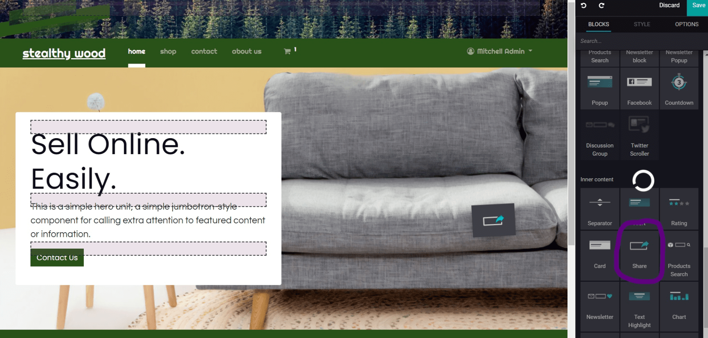
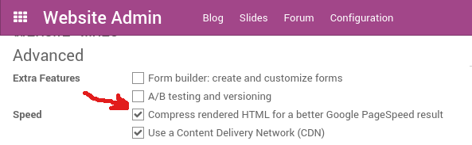
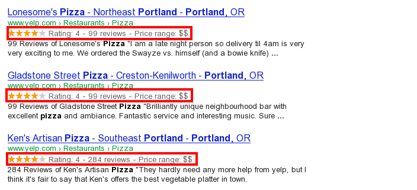

==========================================
How to Do Search Engine Optimization (SEO)
==========================================

Search Engine Optimization (SEO) is a set of good practices to optimize
your website, so you get a better ranking in search engines, like
Google. In short, a good SEO ranking helps you get more visitors.

Some examples of SEO rules: your web pages should load fast, your page
should have one and only one title ``<h1>``, meta tags
(alt-tag, title-tag) should be
consistent with your content, your website should have a
``/sitemap.xml`` file, and so on.

To guarantee Odoo Website and
eCommerce users have a great SEO ranking, Odoo eliminated all the technical
complexities of SEO and handles everything for you - in the best possible
way.

But first, let see how you can easily boost your ranking
by fine-tuning your content and meta tags.

Meta Tags
=========

Title, Description
------------------

Every page on your website should define the ``<title>`` and ``<description>`` meta data.
These information elements are used by search engines to promote your website.
They are automatically generated based on page title and content, but you can
fine-tune them. Make sure they fit the content of the page, otherwise you will 
be downgraded by search engines.

.. image:: media/seo01.png
  :align: center

Keywords
--------
In order to write quality content and boost your traffic, Odoo provides
a ``<keyword>`` finder. Those keywords are the search terms you want to head
towards your website. For each keyword, you'll see how it is used in the content
(H1, H2, page title, page description, page content) and what the related 
searches are in Google. The more keywords used - the better.

.. image:: media/seo02.png
  :align: center

.. note:: 
  If your website is in multiple languages, you can use the Promote
  Tool for every language of a single page, and set specific title, 
  description, and search tags.

Content Is King
===============

When it comes to SEO, content is usually king. Odoo provides several
modules to help you build your website content:

- **Odoo Blogs**: write great content.

- **Odoo Slides**: publish all your Powerpoint or PDF presentations.
  Their content is automatically indexed on the web page. Example:
  `odoo.com/slides/public-channel-1 <https://www.odoo.com/slides/public-channel-1>`_

- **Odoo Forum**: let your community create content for you. Example:
  `odoo.com/forum/1 <https://odoo.com/forum/1>`_
  (accounts for 30% of Odoo.com landing pages)

- **Odoo Mailing List Archive**: publish mailing list archives on your
  website. Example:
  `odoo.com/groups/community-59 <https://www.odoo.com/groups/community-59>`_
  (1000 pages created per month)

.. note::
  The 404 page is a regular page that you can edit like any other
  in Odoo. That way, you can build a great 404 page to redirect to
  the top content of your website when visitors get lost, via invalid URLs.

Use Social Networks
===================

Social media is built for mass-sharing. If lots of people share your content 
on social media, it's likely that more people will link to it, 
and links are a huge factor for SEO rankings.

Odoo embeds several tools to share content through social media:

Social Network
--------------

Odoo allows users to link all their social network accounts in the website footer.
All you have to do is refer to all your accounts in your company settings.

.. image:: media/seo03.png
  :align: center
  
Social Share
------------

Drop the building block *Share* on any page you want your visitors to share.
By clicking the icon, they are prompted to share that page on their social media
feed.



Most social media platforms use a picture of the image to decorate the share post.
Odoo uses the website logo by default, but you can choose any other image 
of your page in the Promote Tool.

.. image:: media/seo05.png
  :align: center
  
Facebook Page
-------------

Drop the building block *Facebook Page* to display a widget of your Facebook 
business page, and encourage visitors to follow it. 
You can display the timeline, the next events, and the messages.

Twitter Scroller
----------------

Display tweets with testimonials from satisfied customers on your website.
This will increase your number of tweets and shares.

Test Your Website
=================

You can compare how your website ranks (in terms of SEO) against Odoo
using WooRank free services:
`woorank.com <https://www.woorank.com>`_

Handling URLs
=============

This section sheds some light on how Odoo makes URLs SEO-friendly.

URL Structure
-------------

A typical Odoo URL will look like this:

- https://www.mysite.com/fr\_FR/shop/product/my-great-product-31

With the following components:

-  **https://** = Protocol

-  **www.mysite.com** = your domain name

-  **/fr\_FR** = page language. This part of the URL is
   removed if the visitor browses the main language of the website.
   Thus, the main version of this page is:
   https://www.mysite.com/shop/product/my-great-product-31

-  **/shop/product** = every module defines its own namespace (/shop is
   for the catalog of the eCommerce module, /shop/product is for a
   product page).

-  **my-great-product** = by default, this is the slugified title of the
   product that this page refers to. But you can customize it for SEO
   purposes. A product named "Pain carré" will be slugified to
   "pain-carre". Depending on the namespace, this could be different
   objects (blog post, page title, forum post, forum comment,
   product category, etc.).

-  **-31** = the unique ID of the product

Note that any dynamic component of a URL can be reduced to its ID. As
an example, the following URLs all do a 301 redirect to the above URL:

-  https://www.mysite.com/fr\_FR/shop/product/31 (short version)

-  http://mysite.com/fr\_FR/shop/product/31 (even shorter version)

-  http://mysite.com/fr\_FR/shop/product/other-product-name-31 (old
   product name)

Some URLs have several dynamic parts, like this one (a blog category and
a post): 

-  https://www.odoo.com/blog/company-news-5/post/the-odoo-story-56

In the above example:

-  *Company News* is the title of the blog

-  *The Odoo Story* is the title of a specific blog post

When an Odoo page has a pager, the page number is set directly in the
URL (does not have a GET argument). This allows every page to be indexed
by search engines. Example: 

-  https://www.odoo.com/blog/page/3

Changes in URLs & Titles
------------------------

When the URL of a page changes (e.g. a more SEO-friendly version of your
product name), you don't have to worry about updating all links:

-  Odoo will automatically update all its links to the new URL.

- If external websites still point to the old URL, a 301 redirect will
  be done, in order to re-route visitors to the new address of the page.

As an example, this URL:

- http://mysite.com/shop/product/old-product-name-31

Will automatically redirect to:

- http://mysite.com/shop/product/new-and-better-product-name-31

In short, if you change the title of a blog post, or the name of a product,
the changes will automatically apply everywhere in your website. The
old link still functions when used by external websites, via a 301 redirect,
maintaining the SEO link power.

HTTPS
-----

Search engines boost rankings of secure HTTPS/SSL websites. 
So, by default, all Odoo Online databases are fully
based on HTTPS. If the visitor accesses your website through a non-HTTPS
URL, they get a 301 redirect to its HTTPS equivalent.

Links: Nofollow Strategy
------------------------

The more a page is linked from external and quality websites, 
the better it is for your SEO ranking.

Here are Odoo strategies to manage links:

- Every link you add to your website is
  "dofollow", which means this link will contribute to the 'SEO
  Juice' for the linked page.

- Every link posted by a contributor (forum post, blog comment, etc.)
  that links to your own website is "dofollow," as well.

- But every link posted by a contributor that links to an external
  website is "nofollow". That way, you do not run the risk of
  people posting links on your website to third-party websites,
  which may have a bad reputation.

- Note that, when using the forum, contributors who have a lot of Karma
  can be trusted. In such case, their links will not have any
  ``rel="nofollow"`` attribute.

Multi-Language Support
======================

Multi-Language URLs
-------------------

If you run a website in multiple languages, the same content will be
available in different URLs, depending on the language used:

- https://www.mywebsite.com/shop/product/my-product-1 (main language, English here)

- https://www.mywebsite.com\/fr\_FR/shop/product/mon-produit-1 (French version)

In this example, fr\_FR is the language of the page. You can even have
several variations of the same language: pt\_BR (Portuguese from Brazil)
, pt\_PT (Portuguese from Portugal).

Language Annotation
-------------------

To let search engines know the second URL is the French translation of the
first URL, Odoo will add an HTML link element in the header. In the HTML
<head> section of the main version, Odoo automatically adds a link
element pointing to the translated versions of that webpage:

-  <link rel="alternate" hreflang="fr"
   href="https://www.mywebsite.com\/fr\_FR/shop/product/mon-produit-1"/>

With this approach:

- Search engines will redirect to the right language, according to the
  visitor language.

- You do not get penalized by search engines if your page is not translated
  yet. However, it's not duplicated content. It's just a different
  version of the same content.

Language Detection
------------------

When a visitor lands for the first time on your website (e.g.
yourwebsite.com/shop), they may automatically be redirected to a
translated version, according to their browser language preference (e.g.
yourwebsite.com/fr\_FR/shop).

Next time, it keeps a cookie of the current language to 
avoid any redirection in the future.

To force a visitor to stick to the default language, you can use the
code of the default language in your link, example:
yourwebsite.com/en\_US/shop. This will always direct visitors to the
English version of the page, without using the browser language
preferences.

Page Speed
==========

Introduction
------------

The time it takes to load a page is an important criteria for search engines. A faster
website not only improves your visitor's experience, it gives
you a better page ranking, as well. Some studies have shown that, if you divide the time to
load time of your pages by two (e.g. 2 seconds instead of 4 seconds), the
visitor abandonment rate is also divided by two (25% to 12.5%). One
extra second to load a page could `cost $1.6b to Amazon in
sales <http://www.fastcompany.com/1825005/how-one-second-could-cost-amazon-16-billion-sales>`__.

.. image:: media/seo06.png
  :align: center

Fortunately, Odoo does all the magic for you. Below, you will find the
tricks Odoo uses to speed up your loading time. You can compare how
your website ranks using these two tools:

- `Google Page Speed <https://developers.google.com/speed/pagespeed/insights/>`__

- `Pingdom Website Speed Test <http://tools.pingdom.com/fpt/>`__

Images
------

When you upload new images, Odoo automatically
compresses them to reduce their size (lossless compression for .PNG
and .GIF and lossy compression for .JPG).

From the upload button, you have the option to keep the original image
unmodified, if you prefer to optimize the quality of the image - rather
than performance.



.. note::
  Odoo compresses images when they are uploaded to your website, not
  when requested by the visitor. Thus, it's possible that, if you use a
  third-party theme, it will provide images that are not compressed
  efficiently. But all images used with official Odoo themes have been
  compressed by default.

When you click on an image, Odoo shows you the Alt and Title attributes
of the ```` tag. You can click on it to set your own Title and Alt
attributes for the image.

.. image:: media/seo08.png
  :align: center

When you click on this link, the following window will appear:

.. image:: media/seo09.png
  :align: center

Odoo's pictograms are implemented using a font (`Font
Awesome <https://fortawesome.github.io/Font-Awesome/icons/>`__ in most
Odoo themes). Thus, you can use as many pictograms as you want, as they will not 
result in extra requests to load the page.

.. image:: media/seo10.png
  :align: center

Static Resources: CSS
---------------------

All CSS files are pre-processed, concatenated, minified, compressed, and
cached (server-side and browser-side). The result:

- only one CSS file request is needed to load a page

- this CSS file is shared and cached amongst pages, so when the
  visitor clicks on another page, the browser doesn't even have to
  load a single CSS resource.

- this CSS file is optimized to be small

**Pre-processed:** The CSS framework used by Odoo is Bootstrap.
Although a theme might use another framework, most of `Odoo
themes <https://www.odoo.com/apps/themes>`__ extend and customize
Bootstrap directly. Since Odoo supports Less and Sass, you can modify
CSS rules, instead of overwriting them through extra CSS lines,
resulting in a smaller file.

**Concatenated:** Every module (or library) you might use in Odoo has its
own set of CSS, Less, or Sass files (eCommerce, blogs, themes, etc.). Having
several CSS files is great for the modularity, but not good for the
performance. Mainly because most browsers can only perform 6 requests in
parallel, resulting in lots of files loaded in series. The
latency time to transfer a file is usually much longer than the actual
data transfer time, especially for small files, like .JS and .CSS. Thus, the time to
load CSS resources depends more on the number of requests to be done
than the actual file size, itself.

To address this issue, all CSS / Less / Sass files are concatenated into
a single .CSS file to send to the browser. That way, a visitor has **only one
.CSS file to load** per page, which is particularly efficient. As the
CSS is shared amongst all pages, when the visitor clicks on another
page, the browser does not even have to load a new CSS file!

================================= =============================================
  **Both files in the <head>**     **What the visitor gets (only one file)**   
================================= =============================================
 /\* From bootstrap.css \*/       .text-muted {                                
 .text-muted {                    color: #666;                                 
 color: #777;                     background: yellow                           
 background: yellow;              }                                             
 }

 /\* From my-theme.css \*/                                                     
 .text-muted {                                                                 
 color: #666;                                                                  
 }                                                                             
================================= =============================================

The CSS sent by Odoo includes all CSS / Less / Sass of all pages and modules. 
By doing this, additional page views from the same visitor will
not have to load CSS files at all. But some modules might include huge
CSS/Javascript resources that you do not want to prefetch at the first
page because they are too big. In this case, Odoo splits this resource
into a second bundle that is loaded only when the page using it is
requested. An example of this is the backend that is only loaded when
the visitor logs-in and accesses the backend (/web).

.. note:: 
  If the CSS file is very big, Odoo will split it into two smaller
  files to avoid the 4095 selectors limit per sheet of Internet Explorer. 
  But most themes fit below this limit.

**Minified:** After being pre-processed and concatenated, the resulting
CSS is minified to reduce its size.

============================ ==============================
  **Before minification**     **After minification**       
============================ ==============================
  /\* some comments \*/       .text-muted {color: #666}    
  .text-muted {                                            
  color: #666;                                             
  }                                                        
============================ ==============================

The final result is then compressed, before being delivered to the
browser.

Then, a cached version is stored server-side (so we do not have
to pre-process, concatenate, minify at every request) and browser-side 
(so the same visitor will load the CSS only once for all pages they
visit).

Static Resources: Javascript
----------------------------

As with CSS resources, Javascript resources are also concatenated,
minified, compressed, and cached (server-side and browser-side).

Odoo creates three Javascript bundles:

- One for all pages of the website (including code for parallax
  effects, form validation, etc.)

- One for common Javascript code shared among frontend and backend
  (Bootstrap)

- One for backend specific Javascript code (Odoo Web Client interface
  for your employees using Odoo)

Most visitors of your website will only need the first two bundles,
resulting in a maximum of two Javascript files to load in order to render one
page. As these files are shared across all pages, further clicks by the
same visitor will not load any other Javascript resource.

.. note::
   If you work on :doc:`Developer mode <../../general/developer_mode/activate>`, the CSS and
   Javascript are neither concatenated, nor minified. Thus, it's much slower. But, it allows you to
   easily debug with the Chrome debugger, as CSS and Javascript resources are not transformed from
   their original versions.

CDN
---

If you activate the CDN feature in Odoo, static resources (Javascript,
CSS, images) are loaded from a Content Delivery Network. Using a Content
Delivery Network has three advantages:

- Load resources from a nearby server (most CDN have servers in main
  countries around the globe)

- Cache resources efficiently (no computation resources used on your
  own server)

- Split the resource loading on different services, allowing to load
  more resources in parallel (since the Chrome limit of 6 parallel
  requests is by domain)

You can configure your CDN options from the **Website Admin** app, using
the Configuration menu. Here is an example of configuration you can use:

.. image:: media/seo11.png
  :align: center

HTML Pages
----------

The HTML pages can be compressed, but this is usually handled by your web
server (NGINX or Apache).

The Odoo Website Builder has been optimized to guarantee clean and short
HTML code. Building blocks have been developed to produce clean HTML
code, usually using Bootstrap and the HTML editor.

As an example, if you use the color picker to change the color of a
paragraph to the primary color of your website, Odoo will produce the
following code:

``<p class="text-primary">My Text</p>``

Whereas most HTML editors (such as, CKEditor) will produce the following
code:

``<p style="color: #AB0201">My Text</p>``

Responsive Design
-----------------

Websites that are not mobile-friendly are negatively
impacted in search engine rankings. All Odoo themes rely on Bootstrap to
render everything efficiently, according to the device: desktop, tablet, or mobile.

.. image:: media/seo12.png
  :align: center

Since all Odoo modules share the same technology, every single page on
your website will be mobile-friendly.

Browser Caching
---------------

Javascript, images, and CSS resources have a URL that changes
dynamically when their content changes. As an example, all CSS files are
loaded through this URL:
`localhost:8069/web/content/457-0da1d9d/web.assets\_common.0.css <http://localhost:8069/web/content/457-0da1d9d/web.assets_common.0.css>`__.
The ``457-0da1d9d`` part of this URL will change if you modify the CSS of
your website.

This allows Odoo to set a very long cache delay (XXX) on these
resources: XXX secs, while being updated instantly, if you update the
resource.

Scalability
-----------

In addition to being fast, Odoo is also more scalable than traditional
CMS and eCommerce platforms (Drupal, Wordpress, Magento, Prestashop). The
following link provides an analysis of the major open-source CMS and
eCommerce systems, compared to Odoo when it comes to high query volumes:
`https://www.odoo.com/slides/slide/197
<https://www.odoo.com/slides/slide/odoo-cms-performance-comparison-and-optimisation-197>`_

.. todo:: fix above link

Here is a slide that summarizes the scalability of Odoo Website & eCommerce.

.. image:: media/seo13.png
  :align: center

Search Engines Files
====================

Sitemap
-------

The sitemap points out pages to index to search engine robots.
Odoo generates a ``/sitemap.xml`` file automatically for you. For
performance reasons, this file is cached and updated every 12 hours.

By default, all URLs will be in a single ``/sitemap.xml`` file, but if you
have a lot of pages, Odoo will automatically create a Sitemap Index
file, respecting the `sitemaps.org
protocol <http://www.sitemaps.org/protocol.html>`__ grouping sitemap
URLs in 45,000 chunks per file.

Every sitemap entry has 4 attributes that are computed automatically:

-  ``<loc>`` : the URL of a page

-  ``<lastmod>`` : last modification date of the resource, computed
   automatically based on related object. For a page related to a
   product, this could be the last modification date of the product
   (or the page).

-  ``<priority>`` : modules may implement their own priority algorithm based
   on their content (example: a forum might assign priority based
   on the number of votes on a specific post). The priority of a
   static page is defined by its priority field, which is
   normalized (16 is the default).

Structured Data Markup
----------------------

Structured Data Markup is used to generate Rich Snippets in search
engine results. It is a way for website owners to send structured data
to search engine robots; helping them understand your content and
create well-presented search results.

Google supports a number of rich snippets for content types, including:
Reviews, People, Products, Businesses, Events, and Organizations.

Odoo implements micro data as defined in the
`schema.org <http://schema.org>`__ specification for events, eCommerce
products, forum posts, and contact addresses. This allows your product
pages to be displayed in Google using extra information, like the price
and rating of a product:



robots.txt
----------

When indexing your website, search engines first take a look at the
general indexing rules of the ``/robots.txt`` file (allowed robots,
sitemap path, etc.). Odoo automatically creates this file for you. It consists of:

User-agent: \*
Sitemap: https://www.odoo.com/sitemap.xml

It means all robots are allowed to index your website,
and there is no other indexing rule specified in the sitemap
found at that address.

You can customize the file *robots* in
:doc:`Developer mode <../../general/developer_mode/activate>` from *Settings --> Technical -->
User Interface --> Views* (exclude robots, exclude some pages, redirect to a custom Sitemap).
Make the Model Data of the view *Non Updatable* in order to not reset the file 
after system upgrades.
