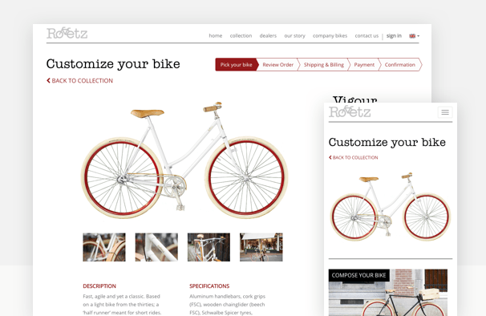

============================================
How to do Search Engine Optimisation in Odoo
============================================

How is SEO handled in Odoo?
===========================

Search Engine Optimization (SEO) is a set of good practices to optimize
your website so that you get a better ranking in search engines like
Google. In short, a good SEO allows you to get more visitors.

Some examples of SEO rules: your web pages should load faster, your page
should have one and only one title ``<h1>``, your website should have a
``/sitemap.xml`` file, etc.

The Odoo Website Builder is probably the most SEO-ready CMS out there.
We consider SEO a top priority. To guarantee Odoo Website and Odoo
eCommerce users have a great SEO, Odoo abstracts all the technical
complexities of SEO and handles everything for you, in the best possible
way.

Page speed
==========

Introduction
------------

The time to load a page is an important criteria for Google. A faster
website not only improves your visitor's experience, but Google gives
you a better page ranking if your page loads faster than your
competitors. Some studies have shown that, if you divide the time to
load your pages by two (e.g. 2 seconds instead of 4 seconds), the
visitor abandonment rate is also divided by two. (25% to 12.5%). One
extra second to load a page could `cost $1.6b to Amazon in
sales <http://www.fastcompany.com/1825005/how-one-second-could-cost-amazon-16-billion-sales>`__.


Fortunately, Odoo does all the magic for you. Below, you will find the
tricks Odoo uses to speed up your page loading time. You can compare how
your website ranks using these two tools:

- `Google Page Speed <https://developers.google.com/speed/pagespeed/insights/>`__

- `Pingdom Website Speed Test <http://tools.pingdom.com/fpt/>`__

Static resources: CSS
---------------------

All CSS files are pre-processed, concatenated, minified, compressed and
cached (server side and browser side). The result:

- only one CSS file request is needed to load a page

- this CSS file is shared and cached amongst pages, so that when the
  visitor clicks on another page, the browser doesn't have to even
  load a single CSS resource.

- this CSS file is optimized to be small

**Pre-processed:** The CSS framework used by Odoo 9 is bootstrap 3.
Although a theme might use another framework, most of `Odoo
themes <https://www.odoo.com/apps/themes>`__ extend and customize
bootstrap directly. Since Odoo supports Less and Sass, so you can modify
CSS rules, instead of overwriting them through extra CSS lines,
resulting in a smaller file.

================================= =============================================
  **Both files in the <head>**     **What the visitor gets (only one file)**   
================================= =============================================
 /\* From bootstrap.css \*/       .text-muted {                                
 .text-muted {                    color: #666;                                 
 color: #777;                     background: yellow                           
 background: yellow;              }                                             
 }

 /\* From my-theme.css \*/                                                     
 .text-muted {                                                                 
 color: #666;                                                                  
 }                                                                             
================================= =============================================

**Concatenated:** every module or library you might use in Odoo has its
own set of CSS, Less or Sass files (eCommerce, blog, theme, etc.) Having
several CSS files is great for the modularity, but not good for the
performance because most browsers can only perform 6 requests in
parallel resulting in lots of files that are loaded in series. The
latency time to transfer a file is usually much longer than the actual
data transfer time, for small files like .JS and .CSS. Thus, the time to
load CSS resources depends more on the number of requests to be done
than the actual file size.

To address this issue, all CSS / Less / Sass files are concatenated into
a single .CSS file to send to the browser. So a visitor has **only one
.CSS file to load** per page, which is particularly efficient. As the
CSS is shared amongst all pages, when the visitor clicks on another
page, the browser does not even have to load a new CSS file!

The CSS sent by Odoo includes all CSS / Less / Sass of all pages /
modules. By doing this, additional page views from the same visitor will
not have to load CSS files at all. But some modules might include huge
CSS/Javascript resources that you do not want to prefetch at the first
page because they are too big. In this case, Odoo splits this resource
into a second bundle that is loaded only when the page using it is
requested. An example of this is the backend that is only loaded when
the visitor logs in and accesses the backend (/web).

.. note:: 
  If the CSS file is very big, Odoo will split it into two smaller
  files to avoid the 4095 selectors limit per sheet of Internet Explorer
  8. But most themes fit below this limit.

**Minified:** After being pre-processed and concatenated, the resulting
CSS is minified to reduce its size.

============================ ==============================
  **Before minification**     **After minification**       
============================ ==============================
  /\* some comments \*/       .text-muted {color: #666}    
  .text-muted {                                            
  color: #666;                                             
  }                                                        
============================ ==============================

The final result is then compressed, before being delivered to the
browser.

Then, a cached version is stored on the server side (so we do not have
to pre-process, concatenate, minify at every request) and the browser
side (so the same visitor will load the CSS only once for all pages he
will visit).

.. note::
  If you are in debug mode, the CSS resources are neither
  concatenated nor minified. That way, it's easier to debug (but it's much
  slower)

Static resources: Javascript
----------------------------

As with CSS resources, Javascript resources are also concatenated,
minified, compressed and cached (server side and browser side).

Odoo creates three Javascript bundles:

- One for all pages of the website (including code for parallax
  effects, form validation, …)

- One for common Javascript code shared among frontend and backend
  (bootstrap)

- One for backend specific Javascript code (Odoo Web Client interface
  for your employees using Odoo)

Most visitors to your website will only need the first two bundles,
resulting in a maximum of two Javascript files to load to render one
page. As these files are shared across all pages, further clicks by the
same visitor will not load any other Javascript resource.

.. note::
  If you work in debug mode, the CSS and javascript are neither
  concatenated, nor minified. Thus, it's much slower. But it allows you to
  easily debug with the Chrome debugger as CSS and Javascript resources
  are not transformed from their original versions.

Images
------

When you upload new images using the website builder, Odoo automatically
compresses them to reduce their sizes. (lossless compression for .PNG
and .GIF and lossy compression for .JPG)

From the upload button, you have the option to keep the original image
unmodified if you prefer to optimize the quality of the image rather
than performance.

.. image:: media/seo02.png
  :align: center

.. note::
  Odoo compresses images when they are uploaded to your website, not
  when requested by the visitor. Thus, it's possible that, if you use a
  third-party theme, it will provide images that are not compressed
  efficiently. But all images used in Odoo official themes have been
  compressed by default.

When you click on an image, Odoo shows you the Alt and title attributes
of the ```` tag. You can click on it to set your own title and Alt
attributes for the image.

.. image:: media/seo03.png
  :align: center

When you click on this link, the following window will appear:

.. image:: media/seo04.png
  :align: center

Odoo's pictograms are implemented using a font (`Font
Awesome <https://fortawesome.github.io/Font-Awesome/icons/>`__ in most
Odoo themes). Thus, you can use as many pictograms as you want in your
page, they will not result in extra requests to load the page.

.. image:: media/seo05.png
  :align: center

CDN
---

If you activate the CDN feature in Odoo, static resources (Javascript,
CSS, images) are loaded from a Content Delivery Network. Using a Content
Delivery Network has three advantages:

- Load resources from a nearby server (most CDN have servers in main
  countries around the globe)

- Cache resources efficiently (no computation resources usage on your
  own server)

- Split the resource loading on different services allowing to load
  more resources in parallel (since the Chrome limit of 6 parallel
  requests is by domain)

You can configure your CDN options from the **Website Admin** app, using
the Configuration menu. Here is an example of configuration you can use:

.. image:: media/seo06.png
  :align: center

HTML Pages
----------

The HTML pages can be compressed, but this is usually handled by your web
server (NGINX or Apache).

The Odoo Website builder has been optimized to guarantee clean and short
HTML code. Building blocks have been developed to produce clean HTML
code, usually using bootstrap and the HTML editor.

As an example, if you use the color picker to change the color of a
paragraph to the primary color of your website, Odoo will produce the
following code:

``<p class="text-primary">My Text</p>``

Whereas most HTML editors (such as CKEditor) will produce the following
code:

``<p style="color: #AB0201">My Text</p>``

Responsive Design
-----------------

As of 2015, websites that are not mobile-friendly are negatively
impacted in Google Page ranking. All Odoo themes rely on Bootstrap 3 to
render efficiently according to the device: desktop, tablet or mobile
phone.



As all Odoo modules share the same technology, absolutely all pages in
your website are mobile friendly. (as opposed to traditional CMS which
have mobile friendly themes, but some specific modules or pages are not
designed to be mobile friendly as they all have their own CSS
frameworks)

Browser caching
---------------

Javascript, images and CSS resources have an URL that changes
dynamically when their content change. As an example, all CSS files are
loaded through this URL:
`http://localhost:8069/web/content/457-0da1d9d/web.assets\_common.0.css <http://localhost:8069/web/content/457-0da1d9d/web.assets_common.0.css>`__.
The ``457-0da1d9d`` part of this URL will change if you modify the CSS of
your website.

This allows Odoo to set a very long cache delay (XXX) on these
resources: XXX secs, while being updated instantly if you update the
resource.

.. todo::
  Describe how the cache strategy works for other resources...

Scalability
-----------

In addition to being fast, Odoo is also more scalable than traditional
CMS' and eCommerce (Drupal, Wordpress, Magento, Prestashop). The
following link provides an analysis of the major open source CMS and
eCommerce compared to Odoo when it comes to high query volumes.

- `*https://www.odoo.com/slides/slide/197* <https://www.odoo.com/slides/slide/odoo-cms-performance-comparison-and-optimisation-197>`__

Here is the slide that summarizes the scalability of Odoo eCommerce and
Odoo CMS. (based on Odoo version 8, Odoo 9 is even faster)

.. image:: media/seo09.png
  :align: center

URLs handling
=============

URLs Structure
--------------

A typical Odoo URL will look like this:

https://www.mysite.com/fr\_FR/shop/product/my-great-product-31

With the following components:

-  **https://** = Protocol

-  **www.mysite.com** = your domain name

-  **/fr\_FR** = the language of the page. This part of the URL is
   removed if the visitor browses the main language of the website
   (english by default, but you can set another language as the main
   one). Thus, the English version of this page is:
   https://www.mysite.com/shop/product/my-great-product-31

-  **/shop/product** = every module defines its own namespace (/shop is
   for the catalog of the eCommerce module, /shop/product is for a
   product page). This name can not be customized to avoid conflicts
   in different URLs.

-  **my-great-product** = by default, this is the slugified title of the
   product this page refers to. But you can customize it for SEO
   purposes. A product named "Pain carré" will be slugified to
   "pain-carre". Depending on the namespace, this could be different
   objects (blog post, page title, forum post, forum comment,
   product category, etc)

-  **-31** = the unique ID of the product

Note that any dynamic component of an URL can be reduced to its ID. As
an example, the following URLs all do a 301 redirect to the above URL:

-  https://www.mysite.com/fr\_FR/shop/product/31 (short version)

-  http://mysite.com/fr\_FR/shop/product/31 (even shorter version)

-  http://mysite.com/fr\_FR/shop/product/other-product-name-31 (old
   product name)

This could be useful to easily get shorter version of an URL and handle
efficiently 301 redirects when the name of your product changes over
time.

Some URLs have several dynamic parts, like this one (a blog category and
a post):

-  https://www.odoo.com/blog/company-news-5/post/the-odoo-story-56

In the above example:

-  Company News: is the title of the blog

-  The Odoo Story: is the title of a specific blog post

When an Odoo page has a pager, the page number is set directly in the
URL (does not have a GET argument). This allows every page to be indexed
by search engines. Example:

-  https://www.odoo.com/blog/page/3

.. note:: 
  Having the language code as fr\_FR is not perfect in terms of SEO.
  Although most search engines treat now "\_" as a word separator, it has
  not always been the case. We plan to improve that for Odoo 10.

Changes in URLs & Titles
------------------------

When the URL of a page changes (e.g. a more SEO friendly version of your
product name), you don't have to worry about updating all links:

-  Odoo will automatically update all its links to the new URL

- If external websites still points to the old URL, a 301 redirect will
  be done to route visitors to the new website

As an example, this URL:

- http://mysite.com/shop/product/old-product-name-31

Will automatically redirect to :

- http://mysite.com/shop/product/new-and-better-product-name-31

In short, just change the title of a blog post or the name of a product,
and the changes will apply automatically everywhere in your website. The
old link still works for links coming from external website. (with a 301
redirect to not lose the SEO link juice)

HTTPS
-----

As of August 2014, Google started to add a ranking boost to secure
HTTPS/SSL websites. So, by default all Odoo Online instances are fully
based on HTTPS. If the visitor accesses your website through a non HTTPS
url, it gets a 301 redirect to its HTTPS equivalent.

Links: nofollow strategy
------------------------

Having website that links to your own page plays an important role on
how your page ranks in the different search engines. The more your page
is linked from external and quality websites, the better is it for your
SEO.

Odoo follows the following strategies to manage links:

- Every link you create manually when creating page in Odoo is
  "dofollow", which means that this link will contribute to the SEO
  Juice for the linked page.

- Every link created by a contributor (forum post, blog comment, ...)
  that links to your own website is "dofollow" too.

- But every link posted by a contributor that links to an external
  website is "nofollow". In that way, you do not run the risk of
  people posting links on your website to third-party websites
  which have a bad reputation.

- Note that, when using the forum, contributors having a lot of Karma
  can be trusted. In such case, their links will not have a
  ``rel="nofollow"`` attribute.

Multi-language support
======================

Multi-language URLs
-------------------

If you run a website in multiple languages, the same content will be
available in different URLs, depending on the language used:

- https://www.mywebsite.com/shop/product/my-product-1 (English version = default)

- https://www.mywebsite.com\/fr\_FR/shop/product/mon-produit-1 (French version)

In this example, fr\_FR is the language of the page. You can even have
several variations of the same language: pt\_BR (Portuguese from Brazil)
, pt\_PT (Portuguese from Portugal).

Language annotation
-------------------

To tell Google that the second URL is the French translation of the
first URL, Odoo will add an HTML link element in the header. In the HTML
<head> section of the English version, Odoo automatically adds a link
element pointing to the other versions of that webpage;

-  <link rel="alternate" hreflang="fr"
   href="https://www.mywebsite.com\/fr\_FR/shop/product/mon-produit-1"/>

With this approach:

- Google knows the different translated versions of your page and will
  propose the right one according to the language of the visitor
  searching on Google

- You do not get penalized by Google if your page is not translated
  yet, since it is not a duplicated content, but a different
  version of the same content.

Language detection
------------------

When a visitor lands for the first time at your website (e.g.
yourwebsite.com/shop), his may automatically be redirected to a
translated version according to his browser language preference: (e.g.
yourwebsite.com/fr\_FR/shop).

Odoo redirects visitors to their prefered language only the first time
visitors land at your website. After that, it keeps a cookie of the
current language to avoid any redirection.

To force a visitor to stick to the default language, you can use the
code of the default language in your link, example:
yourwebsite.com/en\_US/shop. This will always land visitors to the
English version of the page, without using the browser language
preferences.

Meta Tags
=========

Titles, Keywords and Description
--------------------------------

Every web page should define the ``<title>``, ``<description>`` and ``<keywords>``
meta data. These information elements are used by search engines to rank
and categorize your website according to a specific search query. So, it
is important to have titles and keywords in line with what people search
in Google.

In order to write quality meta tags, that will boost traffic to your
website, Odoo provides a **Promote** tool, in the top bar of the website
builder. This tool will contact Google to give you information about
your keywords and do the matching with titles and contents in your page.

.. image:: media/seo10.png
  :align: center

.. note:: 
  If your website is in multiple languages, you can use the Promote
  tool for every language of a single page;

In terms of SEO, content is king. Thus, blogs play an important role in
your content strategy. In order to help you optimize all your blog post,
Odoo provides a page that allows you to quickly scan the meta tags of
all your blog posts.

.. image:: media/seo11.png
  :align: center

.. note::
  This /blog page renders differently for public visitors that are
  not logged in as website administrator. They do not get the warnings and
  keyword information.

Sitemap
-------

Odoo will generate a ``/sitemap.xml`` file automatically for you. For
performance reasons, this file is cached and updated every 12 hours.

By default, all URLs will be in a single ``/sitemap.xml`` file, but if you
have a lot of pages, Odoo will automatically create a Sitemap Index
file, respecting the `sitemaps.org
protocol <http://www.sitemaps.org/protocol.html>`__ grouping sitemap
URL's in 45000 chunks per file.

Every sitemap entry has 4 attributes that are computed automatically:

-  ``<loc>`` : the URL of a page

-  ``<lastmod>`` : last modification date of the resource, computed
   automatically based on related object. For a page related to a
   product, this could be the last modification date of the product
   or the page

-  ``<priority>`` : modules may implement their own priority algorithm based
   on their content (example: a forum might assign a priority based
   on the number of votes on a specific post). The priority of a
   static page is defined by it's priority field, which is
   normalized. (16 is the default)

Structured Data Markup
----------------------

Structured Data Markup is used to generate Rich Snippets in search
engine results. It is a way for website owners to send structured data
to search engine robots; helping them to understand your content and
create well-presented search results.

Google supports a number of rich snippets for content types, including:
Reviews, People, Products, Businesses, Events and Organizations.

Odoo implements micro data as defined in the
`schema.org <http://schema.org>`__ specification for events, eCommerce
products, forum posts and contact addresses. This allows your product
pages to be displayed in Google using extra information like the price
and rating of a product:

.. image:: media/seo12.png
  :align: center

robots.txt
----------

Odoo automatically creates a ``/robots.txt`` file for your website. Its
content is:

User-agent: \*

Sitemap: https://www.odoo.com/sitemap.xml

Content is king
===============

When it comes to SEO, content is usually king. Odoo provides several
modules to help you build your contents on your website:

- **Odoo Slides**: publish all your Powerpoint or PDF presentations.
  Their content is automatically indexed on the web page. Example:
  `https://www.odoo.com/slides/public-channel-1 <https://www.odoo.com/slides/public-channel-1>`__

- **Odoo Forum**: let your community create contents for you. Example:
  `https://odoo.com/forum/1 <https://odoo.com/forum/1>`__
  (accounts for 30% of Odoo.com landing pages)

- **Odoo Mailing List Archive**: publish mailing list archives on your
  website. Example:
  `https://www.odoo.com/groups/community-59 <https://www.odoo.com/groups/community-59>`__
  (1000 pages created per month)

- **Odoo Blogs**: write great contents.

.. note::
  The 404 page is a regular page, that you can edit like any other
  page in Odoo. That way, you can build a great 404 page to redirect to
  the top content of your website.

Social Features
===============

Twitter Cards
-------------

Odoo does not implement twitter cards yet. It will be done for the next
version.

Social Network
--------------

Odoo allows to link all your social network accounts in your website.
All you have to do is to refer all your accounts in the **Settings** menu of
the **Website Admin** application.

Test Your Website
=================

You can compare how your website rank, in terms of SEO, against Odoo
using WooRank free services:
`https://www.woorank.com <https://www.woorank.com>`__
