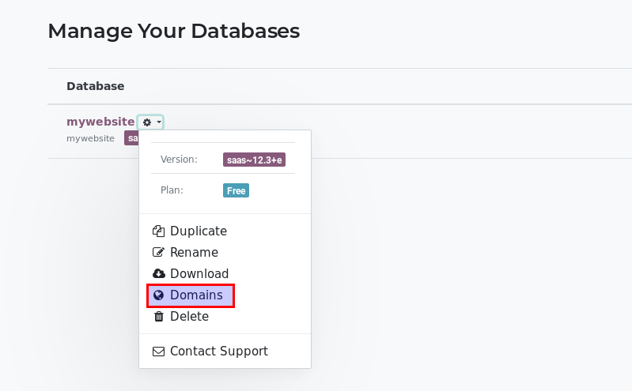

=============================
How to use my own domain name
=============================

By default, your Odoo Online instance and website have a *.odoo.com* domain name, 
for both the URL and the emails. 
But you can change to a custom one (e.g. www.yourcompany.com).

What is a good domain name
==========================
Your website address is as important to your branding as the name of your 
business or organization, so put some thought into changing it for a proper 
domain. Here are some tips:

- Simple and obvious
- Easy to remember and spell
- The shorter the better
- Avoid special characters
- Aim for a .com and/or your country extension

Read more: `How to Choose a Domain Name for Maximum SEO <https://www.searchenginejournal.com/choose-a-domain-name-maximum-seo/158951/>`__

How to buy a domain name
========================
Buy your domain name at a popular registrar:

- `GoDaddy <https://www.godaddy.com>`__  
- `Namecheap <https://www.namecheap.com>`__  
- `OVH <https://www.ovh.com>`__ 

.. note:: Steps to buy a domain name are pretty much straight forward. 
   In case of issue, check out those easy tutorials:

   - `GoDaddy <https://roadtoblogging.com/buy-domain-name-from-godaddy>`__
   - `Namecheap <https://www.loudtips.com/buy-domain-name-hosting-namecheap//>`__

   Feel free to buy an email server to have email addresses using your domain name.
   However don't buy any extra service to create or host your website. 
   This is Odoo's job!

.. _custom_domain:

How to apply my domain name to my Odoo instance
===============================================
First let's authorize the redirection (yourcompany.com -> yourcompany.odoo.com):

* Open your Odoo.com account from your homepage.

.. image:: media/domain_name01.png
    :align: center

* Go to the *Manage Databases* page.

.. image:: media/domain_name02.png
    :align: center

* Click on *Domains* to the right of the database you would like to redirect.

* A database domain prompt will appear. Enter your custom domain 
  (e.g. www.yourcompany.com).

.. image:: media/domain_name04.png
    :align: center

We can now apply the redirection from your domain name's manager account:

* Log in to your account and search for the DNS Zones management page.

* Create a CNAME record *www.yourdomain.com* pointing to *mywebsite.odoo.com*.
  If you want to use the naked domain (e.g. yourdomain.com), you need to redirect 
  *yourdomain.com* to *www.yourdomain.com*.

.. note:: Here are some specific guidelines to create a CNAME record:

   - `GoDaddy <https://be.godaddy.com/fr/help/add-a-cname-record-19236>`__
   - `Namecheap <https://www.namecheap.com/support/knowledgebase/article.aspx/9646/10/how-can-i-set-up-a-cname-record-for-my-domain>`__
   - `OVH <https://www.ovh.co.uk/g1519.exchange_20132016_how_to_add_a_cname_record>`__

How to enable SSL (HTTPS) for my Odoo instance
==============================================

To enable SSL, please use a third-party CDN service provider 
such as CloudFlare.com. 

.. seealso::

  * :doc:`../../discuss/email_servers`

    
    

