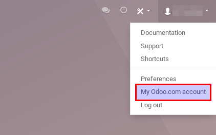
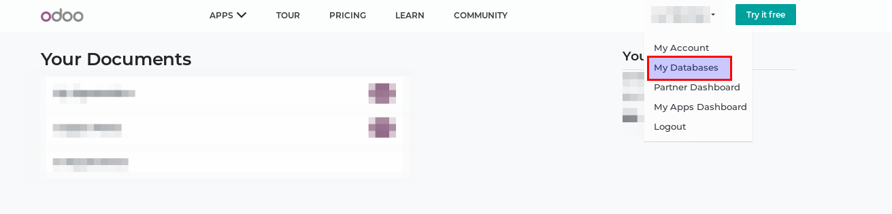

=============================
How to use my own domain name
=============================

By default, your Odoo Online instance and website have a *.odoo.com* domain name, 
for both the URL and the emails. 
But you can change to a custom one (e.g. www.yourcompany.com).

What is a good domain name
==========================
Your website address is as important to your branding as the name of your 
business or organization, so put some thought into changing it for a proper 
domain. Here are some tips:

- Simple and obvious
- Easy to remember and spell
- The shorter the better
- Avoid special characters
- Aim for a .com and/or your country extension

Read more: `How to Choose a Domain Name for Maximum SEO <https://www.searchenginejournal.com/choose-a-domain-name-maximum-seo/158951/>`__

How to buy a domain name
========================
Buy your domain name at a popular registrar:

- `GoDaddy <https://www.godaddy.com>`__  
- `Namecheap <https://www.namecheap.com>`__  
- `OVH <https://www.ovh.com>`__ 

.. note:: Steps to buy a domain name are pretty much straight forward. 
   In case of issue, check out those easy tutorials:

   - `GoDaddy <https://roadtoblogging.com/buy-domain-name-from-godaddy>`__
   - `Namecheap <https://www.loudtips.com/buy-domain-name-hosting-namecheap//>`__

   Feel free to buy an email server to have email addresses using your domain name.
   However don't buy any extra service to create or host your website. 
   This is Odoo's job!

.. _custom_domain:

How to apply my domain name to my Odoo instance
===============================================
First let's authorize the redirection (yourcompany.com -> yourcompany.odoo.com):

* Open your Odoo.com account from your homepage.

* Go to the *Manage Databases* page.

* Click on *Domains* to the right of the database you would like to redirect.

.. image:: media/domain_name03.png
    :align: center

* A database domain prompt will appear. Enter your custom domain 
  (e.g. www.yourcompany.com).

.. image:: media/domain_name04.png
    :align: center

We can now apply the redirection from your domain name's manager account:

* Log in to your account and search for the DNS Zones management page.

* Create a CNAME record *www.yourdomain.com* pointing to *mywebsite.odoo.com*.
  If you want to use the naked domain (e.g. yourdomain.com), you need to redirect 
  *yourdomain.com* to *www.yourdomain.com*.

.. note:: Here are some specific guidelines to create a CNAME record:

   - `GoDaddy <https://be.godaddy.com/fr/help/add-a-cname-record-19236>`__
   - `Namecheap <https://www.namecheap.com/support/knowledgebase/article.aspx/9646/10/how-can-i-set-up-a-cname-record-for-my-domain>`__
   - `OVH <https://www.ovh.co.uk/g1519.exchange_20132016_how_to_add_a_cname_record>`__

Impact on email deliverability
==============================

If your domain is configurable and you are using email addresses associate with it, you might need to configure it to avoid your email to be received in spam.

Consider reading our documentation regarding SPF, DKIM and DMARC
  * :doc:`../../email_communication/advanced/email_servers`

How to enable SSL (HTTPS) for my Odoo instance
==============================================

Until recently, Odoo users needed to use a third-party CDN service provider such as CloudFlare to enable SSL.

It is not required anymore: Odoo generates the certificate for you automatically, using integration with `Let's Encrypt Certificate Authority and ACME protocol <https://letsencrypt.org/how-it-works/>`__.
In order to get this, simply add your domain name in your customer portal (a separate certificate is generated for each domain name specified).

.. warning::
  **Please note that the certificate generation may take up to 24h.**

If you already use CloudFlare or a similar service, you can keep using it or simply change for Odoo. The choice is yours.

How to make sure that all my URLs use my custom domain?
=======================================================

To set up the root URL of your website and of all the links sent in emails, you can ask an administrator of your database (any user in the *Settings* group) to perform a login from the login screen. It's as simple as that!

If you want to do it manually, you can go to :menuselection:`Settings --> Technical --> System Parameters` . 
Find the entry called ``web.base.url`` (you can create it if it does not exist) and enter the full URL of your website, like ``https://www.myodoowebsite.com``.

.. warning::
  The URL must include the protocol (``https://`` or ``http://``) and must not end by a slash (``/``).

If you want to block the root URL update when an administrator logs in, you can add a System Parameter called  ``web.base.url.freeze`` with its value set to  ``True``.

My website is indexed twice by Google
=====================================

If you set up a custom domain *mydomain.com* name for *mydatabase.odoo.com*,
Google indexes your website under both names. This is a limitation of the Odoo cloud platforms/

.. seealso::

  * :doc:`../../email_communication/advanced/email_servers`

    
    

