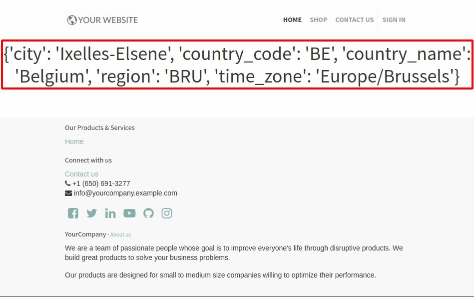

===========================================
Geo IP installation (on-premise database)
===========================================

Installation
============

.. warning:: Please note that the installation depends on your computer operating system and distribution. We will assume here that a Linux operating system is used.

#. Install `geoip2 <https://pypi.org/project/geoip2/>`__ python library
    .. code-block:: bash

      pip install geoip2

#. Download the `GeoLite2 City database <https://dev.maxmind.com/geoip/geoip2/geolite2/>`__. You should end up with a file call ``GeoLite2-City.mmdb``
#. Move the file to the folder ``/usr/share/GeoIP/``
    .. code-block:: bash

        mv ~/Downloads/GeoLite2-City.mmdb /usr/share/GeoIP/

#. Start the server

.. note:: If for some reason you can't perform step 3 you can use the ``--geoip-db`` option instead.
    This option need the absolute path to the GeoIP database file and will use it as the GeoIP database.
    For example:

    .. code-block:: bash

        ./odoo-bin --geoip-db= ~/Download/GeoLite2-City.mmdb

.. warning:: In previous Odoo version ``GeoIP`` python library was used. But it is no longer supported with current versions.

Test
====
1. Go into your website. Open the web page on which you want to test ``GeoIP``.
2. Choose :menuselection:`Customize --> HTML/CSS/JS Editor`.
3. Add the following piece of XML in the page :

.. code-block:: xml

    <h1 class="text-center" t-esc="request.session.get('geoip')"/>

You should end up with a dictionary indicating the location of the ip address.

.. note:: If the curly braces are empty ``{}``, it can be for any of the following reason :

   - The browsing IP address is the localhost (``127.0.0.1``) or a local area network one (``192.168.*.*``)
   - If a reversed proxy is used, make sure to configure it correctly
   - ``geoip2`` is not installed or the GeoIP database file wasn't found
   - The GeoIP database was unable to resolve the given IP address

    
    

