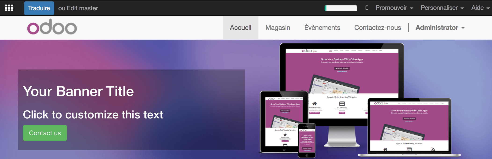

===============================
How to translate my website
===============================

Overview
========

In addition to creating great modern websites, Odoo gives you the
possibility to translate it in different languages.

Process
=======

Once your website is created, you have the opportunity to translate it
in as many different languages as you want.

There are two ways to translate your website, you can do it manually or
automatically with the Gengo App. If you want to do it automatically, go
to the **App** module and Install **Automated translations through Gengo
Api** and **Website Gengo Translator**. If you want to do it manually,
don't install anything, and follow the next step.

Now go to your website. On the bottom right corner of the page, click on
**Add a language**.

Choose the language in which you want to translate your website and then
click on **Load.**

You will see that Now, next to English there is also French, which means
that the page for the translation has been created. You can also see
that some of the text has been translated automatically.

To translate the content of the website, click on **Translate** (here
**Traduire** since we want to translate the website in French).

There, if you have installed the Gengo Translator, You will see that
next to the **Translate** button you also have a button **Translate
automatically**. Once you click on that button, you will be asked some
information on your account. If you don't have an account yet, go to
`*https://gengo.com/auth/form/login/* <https://gengo.com/auth/form/login/>`__
in order to create one. You need to ask for a public key and a private
key.

The content you wish to translate will then be translated automatically.

Now you can see that most of the content is highlighted in yellow or
in green. The yellow represents the content that you have to translate by
yourself. The green represents the content that has already been translated
automatically.

.. image:: media/translate_website05.png
    :align: center
